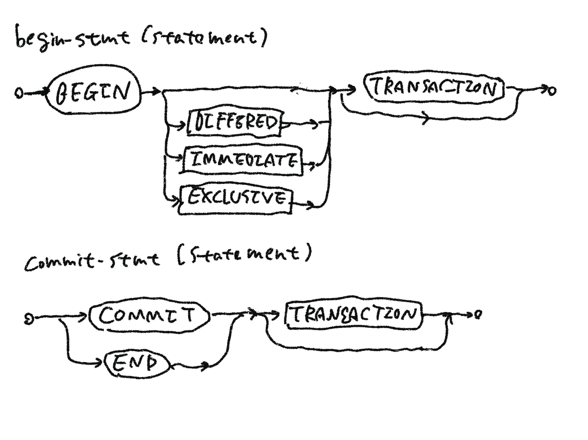
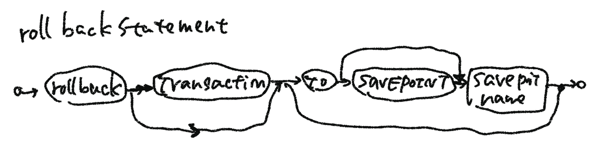
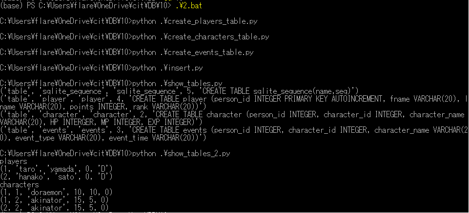
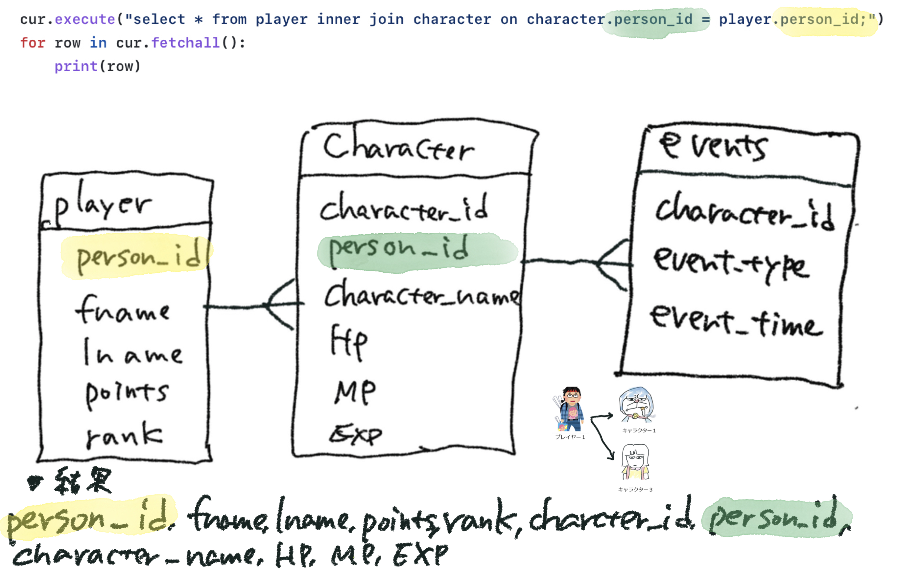

# transactionの構文図(syntax diagram)





# 0. 2.batを実行する



<pre>
players
(1, 'taro', 'yamada', 0, 'D')
(2, 'hanako', 'sato', 0, 'D')
characters
(1, 1, 'doraemon', 10, 10, 0)
(1, 2, 'akinator', 15, 5, 0)
(2, 2, 'akinator', 15, 5, 0)
</pre>

# 1 charaterとplayerをjoinする



<pre>
(base) C:\Users\flare\OneDrive\cit\DB\10>python join.py
(1, 'taro', 'yamada', 0, 'D', 1, 1, 'doraemon', 10, 10, 0)
(1, 'taro', 'yamada', 0, 'D', 1, 2, 'akinator', 15, 5, 0)
(2, 'hanako', 'sato', 0, 'D', 2, 2, 'akinator', 15, 5, 0)
</pre>

# 2. joinにより生成されるステータス画面イメージ


入れ子のリストからHTML画面を生成

# 3. キャラクタを作成

3.1 ドラえもんをターゲットにして、3～5秒間に一度、ドラえもんのHPを80％の確率で、半分にするキャラクターを作成


3.2 全キャラクターを対象に、5秒間に一度、HPを0～20の範囲で、回復させるキャラクターを作成


```
#!/usr/bin/env python
# -*- coding: utf-8 -*-

import sqlite3
import random
import time

dbname = 'cit-7.db'
# 1.データベースに接続
conn = sqlite3.connect(dbname)

i = 0

while i < 500:

	# 2.sqliteを操作するカーソルオブジェクトを作成
	cur = conn.cursor()

	# 3.

	print("[before:recover]")
	print("player ID, character ID, character_nane, HP")

	cur.execute('select * from character;')

	for row in cur:

		cur2 = conn.cursor()

		print(row)
		strhp = str(row[0]) + "," + str(row[1]) + "," + str(row[2]) + "," + str(row[3])
		#print(strhp)

		charaID = row[1];
		recover = random.randint(0, 20)	
		currentHP = row[3]
		nextHP = currentHP + recover

		comstr = "update character set HP=" + str(nextHP) + " where character_id = " + str(charaID) + ";"
		#print(comstr)
		cur2.execute(comstr)

		cur2.close()
	
	conn.commit()

	print("---")
	print("[after:recover]")
	print("player ID, character ID, character_nane, HP")

	cur.execute('select * from character;')
	for row in cur:
		print(row)
    
	time.sleep(5)
    
# 5.データベースの接続を切断
cur.close()
conn.close()
```

3.3 3.2のキャラクターの操作をTransactionで保護する

```
#!/usr/bin/env python
# -*- coding: utf-8 -*-

import sqlite3
import random
import time

dbname = 'cit-7.db'
# 1.データベースに接続
conn = sqlite3.connect(dbname)

i = 0

while i < 500:

	# 2.sqliteを操作するカーソルオブジェクトを作成
	cur = conn.cursor()

	# 3.

	print("[before:recover(with transaction)]")
	print("player ID, character ID, character_nane, HP")

	for row in cur:

		cur2 = conn.cursor()

		print(row)
		strhp = str(row[0]) + "," + str(row[1]) + "," + str(row[2]) + "," + str(row[3])
		#print(strhp)

		charaID = row[1];
		recover = random.randint(0, 20)	
		currentHP = row[3]
		nextHP = currentHP + recover

		cur.execute('BEGIN IMMEDIATE TRANSACTION recover;')
		cur.execute('select * from character;')

		comstr = "update character set HP=" + str(nextHP) + " where character_id = " + str(charaID) + ";"
		#print(comstr)
		cur2.execute(comstr)
		cur.execute('COMMIT;')
		
		cur2.close()
	
	conn.commit()


	print("---")
	print("[after:recover(with transaction)]")
	print("player ID, character ID, character_nane, HP")

	cur.execute('select * from character;')
	for row in cur:
		print(row)


    
	time.sleep(5)
    
# 5.データベースの接続を切断
cur.close()
conn.close()
```
