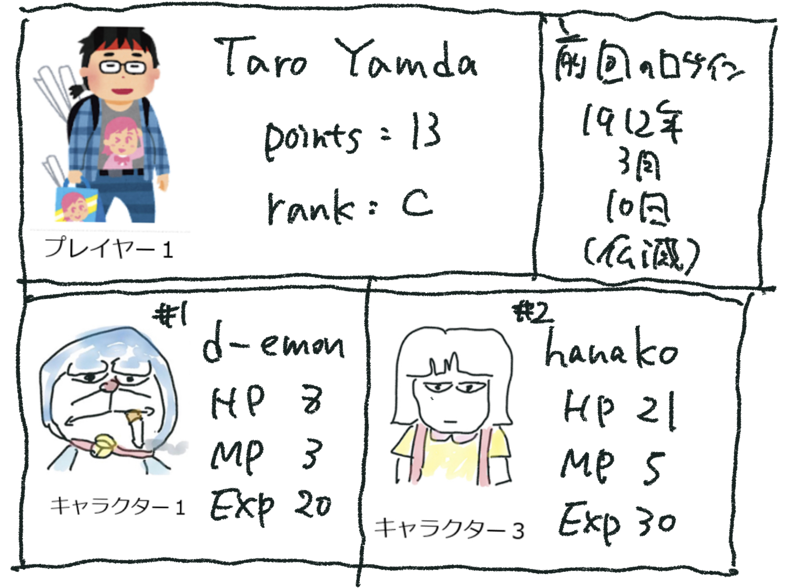

# 0. 2.batを実行する

<pre>
players
(1, 'taro', 'yamada', 0, 'D')
(2, 'hanako', 'sato', 0, 'D')
characters
(1, 1, 'doraemon', 10, 10, 0)
(1, 2, 'akinator', 15, 5, 0)
(2, 2, 'akinator', 15, 5, 0)
</pre>

# 1 charaterとplayerをjoinする

<pre>
(base) C:\Users\flare\OneDrive\cit\DB\10>python join.py
(1, 'taro', 'yamada', 0, 'D', 1, 1, 'doraemon', 10, 10, 0)
(1, 'taro', 'yamada', 0, 'D', 1, 2, 'akinator', 15, 5, 0)
(2, 'hanako', 'sato', 0, 'D', 2, 2, 'akinator', 15, 5, 0)
</pre>

#2 ．　ドラえもんをターゲットにして、３～５秒間に一度、ドラえもんのHPを８０％の確率で、半分にするキャラクター（ダークのび太）を作成
