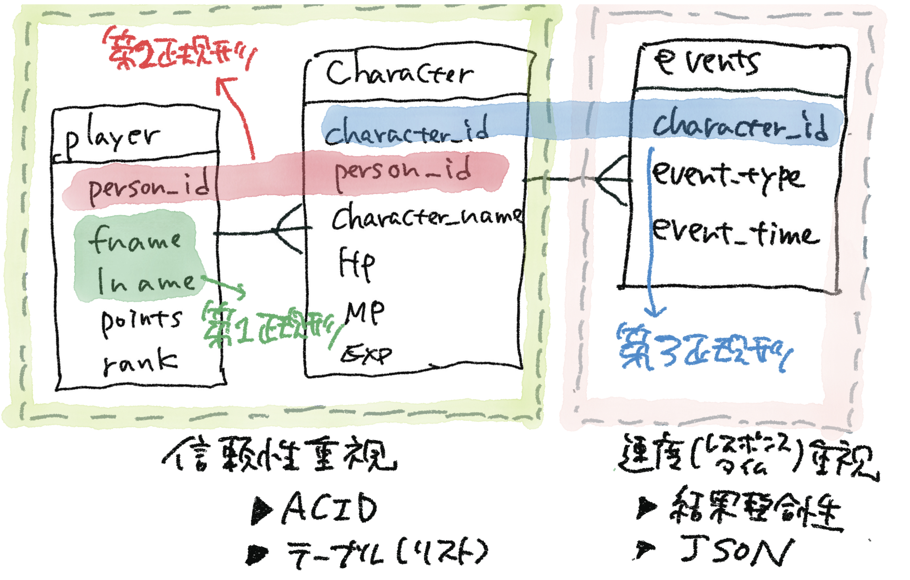
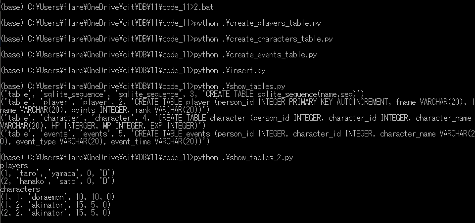
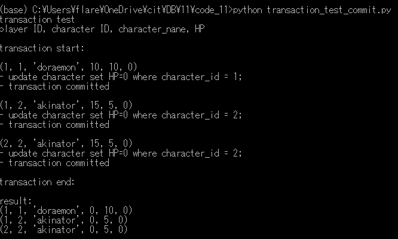

# 0. 概要
信頼性と速度


# 1. Transaction 


# 2. CommitとRollbackの実行比較

```
(base) C:\Users\flare\OneDrive\cit\DB\11\code_11>2.bat
(base) C:\Users\flare\OneDrive\cit\DB\11\code_11>git add transaction_test_commit.py
```

初期化


Transactionコマンドの実行



