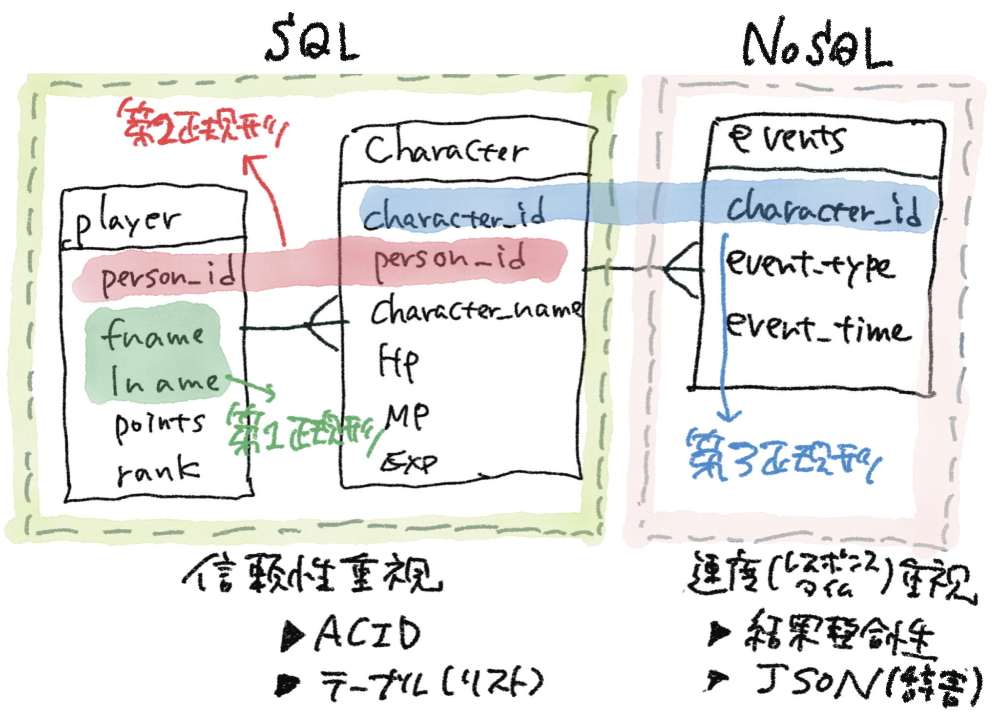
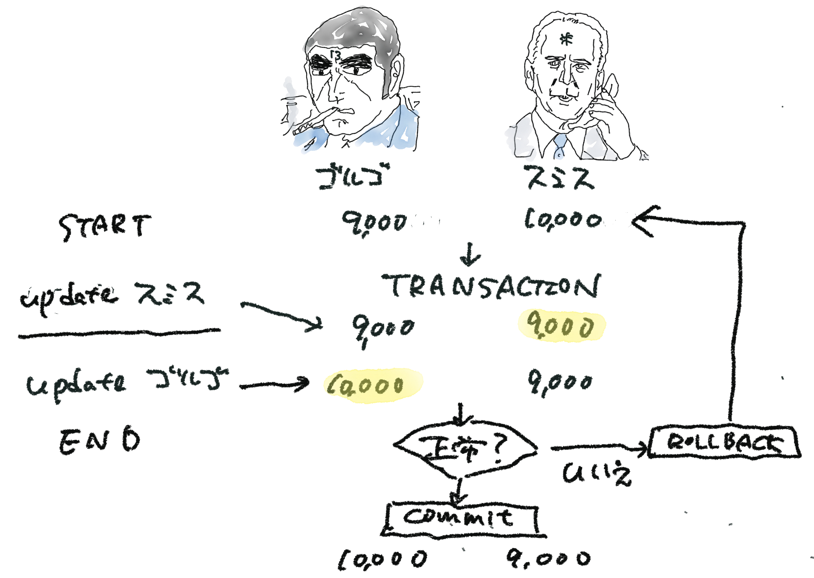

# 0. 概要
信頼性と速度

# 1. Transaction 

# 2. CommitとRollbackの実行比較
<pre>
TRANSACTIONコマンド実行
(base) C:\Users\flare\OneDrive\cit\DB\11\code_11>2.bat
(base) C:\Users\flare\OneDrive\cit\DB\11\code_11>python transaction_test_commit.py
</pre>

<pre>
ROLLBACKコマンド実行
(base) C:\Users\flare\OneDrive\cit\DB\11\code_11>2.bat
(base) C:\Users\flare\OneDrive\cit\DB\11\code_11>python transaction_test_rollback.py
</pre>

# 3. Transaction 処理時間の計測

