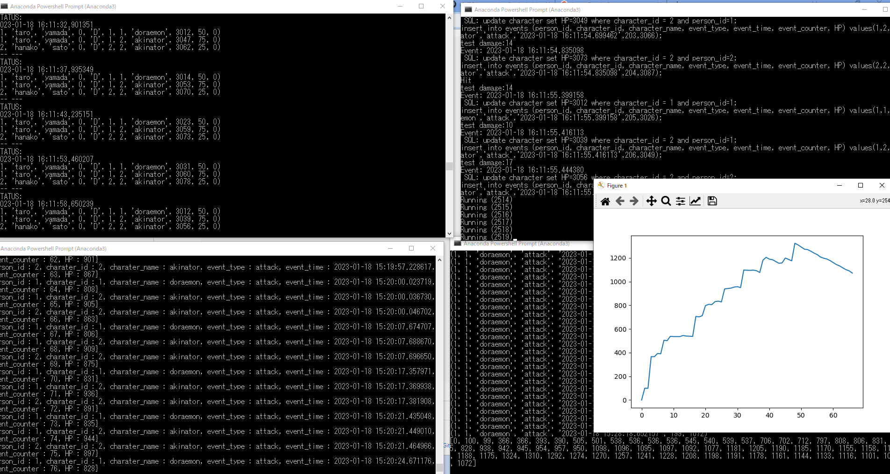

# 0. CSVからJSONファイルへ書き換え
太郎さんは２つキャラを、花子さんは１つのキャラを持っている
CSV (comma separated value) 
person_ID, first_name, last_name, character_ID, character_name, HP, MP, EXP

CSV
<pre>
(1, 'taro', 'yamada', 1, 'doraemon', 14, 10, 0)
(1, 'taro', 'yamada', 2, 'akinator', 20, 5, 0)
(2, 'hanako', 'sato', 2, 'akinator', 16, 5, 0)
</pre>

JSON
<pre>
{
 "person_id" : "1",
 "first_name" : "yamada",
 "last_name": "taro", 
	"characters" : [
		{
			charater_id : "1",
			character_name : "doraemon", 
			HP : "15",
			MP : "10",
			EXP : "0"
		},
		{
			charater_id : "2",
			character_name : "akinator", 
			HP : "10",
			MP : "15",
			EXP : "5"
		}
	]
}

{
"person_id" : "2", 
 "first_name" : "hanako",
 "last_name": "sato",
	"characters" : [
		{
			charater_id : "1",
			character_name : "doraemon", 
			HP : "15",
			MP : "10",
			EXP : "0"
		}
	]
}	 
</pre>

# 1. プログラム構成

loop_join.py
一定時間ごとに、各キャラクタのステータスを表示し、HPをランダムに回復させる

select * from player inner join character on character.person_id = player.person_id;

update character set HP=3061 where character_id = 1 and person_id=1;
update character set HP=3109 where character_id = 2 and person_id=1;
update character set HP=3089 where character_id = 2 and person_id=2;

warikomi2.ps1
各キャラクタのHPを減少させる

update character set HP=3060 where character_id = 2 and person_id=2;
insert into events (person_id, character_id, character_name, event_type, event_time, event_counter, HP) values(2,2,'akinator','attack','2023-01-18 16:20:28.796926',213,3074);

show_event.py
キャラクタのHPの推移を表示する

