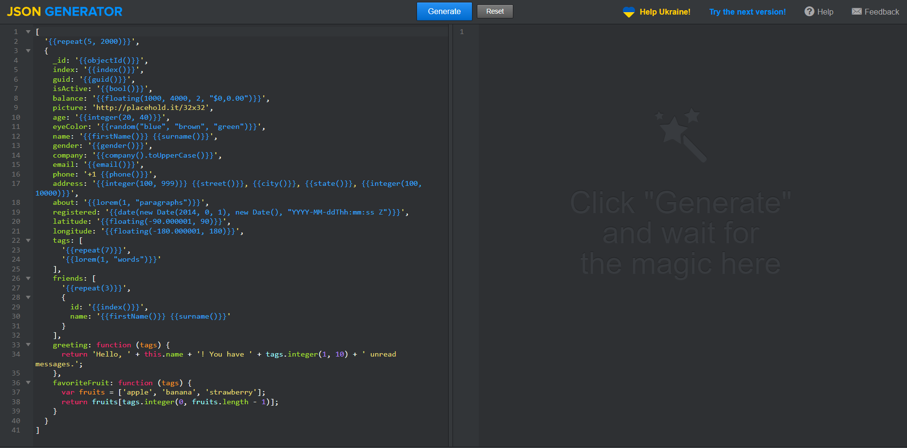

# 1. テストデータ1(JSON, CSV)の生成
<pre>
dummyjson sample-json.hbs > test_data.json
dummyjson sample-csv.hbs > test_data.csv
</pre>

# 2. テストデータ1のCSVファイルのsqliteへの取り込み
<pre>
Use ".open FILENAME" to reopen on a persistent database.
sqlite> .mode csv

sqlite> .import test_data.csv test_data
test_data.csv:2: expected 8 columns but found 7 - filling the rest with NULL

sqlite> .tables
test_data

sqlite> select * from test_data where id=48;
48,"Francis Winter",Xenosys,1989,"65 Elton Way",Medford,false,
</pre>

# 3. テストデータ2(JSON)の生成
<pre>
https://json-generator.com/
</pre>

# 4. 保存したテストデータ2のJSONファイル(person.json)をCSVに変換(Linux)
<pre>
# in2csv person.json  > person.csv
/usr/lib/python3.6/importlib/_bootstrap.py:219: ImportWarning: can't resolve package from __spec__ or __package__, falling back on __name__ and __path__
</pre>

# 5. 下記のコマンドを実行 (SQL .import)
<pre>
(base) PS C:\Users\flare\cit\DB\5> .\sqlite3.exe
SQLite version 3.39.3 2022-09-05 11:02:23
Enter ".help" for usage hints.
Connected to a transient in-memory database.
Use ".open FILENAME" to reopen on a persistent database.
sqlite> .mode csv
sqlite> .import person.csv person
sqlite> select eyeColor from person limit 5;
green
blue
blue
green
brown
</pre>

# 6. 下記のコマンドを実行 (SQL group by)

<pre>
sqlite> select eyeColor from person group by eyeColor;
blue
brown
green
sqlite> select eyeColor, COUNT(eyeColor) from person group by eyeColor;
</pre>

# 7. 年齢の総和を求める (SQL sum)

<pre>
sqlite> SELECT SUM(age) FROM person;
26067
</pre>

# 8. 年齢の総和を求める (JSON/Python)

(base) PS C:\Users\flare\cit\DB\5> python sum.py person.json
26067

# 9. 瞳の色ごとの人数を求める (SQL COUNT, GROUP BY)

<pre>
(base) PS C:\Users\flare\cit\DB\5> .\sqlite3.exe                                                                       
SQLite version 3.39.3 2022-09-05 11:02:23
Enter ".help" for usage hints.
Connected to a transient in-memory database.
Use ".open FILENAME" to reopen on a persistent database.
sqlite> .import person.csv person

sqlite> select eyeColor, count(*) from person group by eyeColor;
blue,301
brown,281
green,294
</pre>

