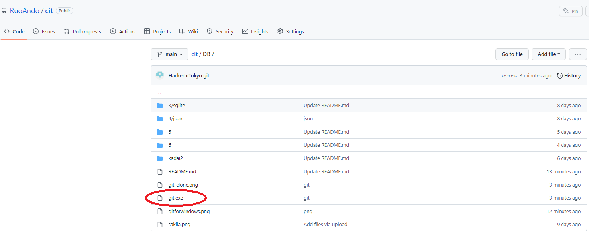
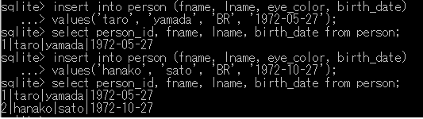
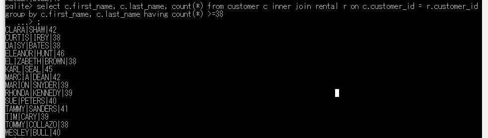

# 0. git.exeのダウンロード

<pre>
https://github.com/RuoAndo/cit/blob/main/DB/git.exe
</pre>

下記のコマンドを実行
<pre>
(base) PS C:\Users\flare\cit\DB> git clone https://github.com/RuoAndo/cit.git
</pre>

# 1. sakila DBを開く

<pre>
sqlite> .open sakila_master.db
sqlite> .tables
actor                   film                    payment
address                 film_actor              rental
category                film_category           sales_by_film_category
city                    film_list               sales_by_store
country                 film_text               staff
customer                inventory               staff_list
customer_list           language                store
</pre>

# 2. 重複を取り除く (SQL distinct)

<pre>
sqlite> .schema film_actor
CREATE TABLE film_actor (
  actor_id INT NOT NULL,
  film_id  INT NOT NULL,
  last_update TIMESTAMP NOT NULL,
  PRIMARY KEY  (actor_id,film_id),
  CONSTRAINT fk_film_actor_actor FOREIGN KEY (actor_id) REFERENCES actor (actor_id) ON DELETE NO ACTION ON UPDATE CASCADE,
  CONSTRAINT fk_film_actor_film FOREIGN KEY (film_id) REFERENCES film (film_id) ON DELETE NO ACTION ON UPDATE CASCADE
);

sqlite> select actor_id from film_actor order by actor_id limit 5;
1
1
1
1
1
</pre>

actor_idの重複を削除する

<pre>
sqlite> select distinct actor_id from film_actor order by actor_id limit 5;
1
2
3
4
</pre>

# 3. テーブルのリンク (SQL JOIN)

customerテーブル
<pre> 
sqlite> .schema customer
CREATE TABLE customer (
  customer_id INT NOT NULL,
  store_id INT NOT NULL,
  first_name VARCHAR(45) NOT NULL,
  last_name VARCHAR(45) NOT NULL,
  email VARCHAR(50) DEFAULT NULL,
  address_id INT NOT NULL,
  active CHAR(1) DEFAULT 'Y' NOT NULL,
  create_date TIMESTAMP NOT NULL,
  last_update TIMESTAMP NOT NULL,
  PRIMARY KEY  (customer_id),
  CONSTRAINT fk_customer_store FOREIGN KEY (store_id) REFERENCES store (store_id) ON DELETE NO ACTION ON UPDATE CASCADE,
  CONSTRAINT fk_customer_address FOREIGN KEY (address_id) REFERENCES address (address_id) ON DELETE NO ACTION ON UPDATE CASCADE
);
</pre>

schemaテーブル
<pre> 
sqlite> .schema rental
CREATE TABLE rental (
  rental_id INT NOT NULL,
  rental_date TIMESTAMP NOT NULL,
  inventory_id INT  NOT NULL,
  customer_id INT  NOT NULL,
  return_date TIMESTAMP DEFAULT NULL,
  staff_id SMALLINT  NOT NULL,
  last_update TIMESTAMP NOT NULL,
  PRIMARY KEY (rental_id),
  CONSTRAINT fk_rental_staff FOREIGN KEY (staff_id) REFERENCES staff (staff_id) ,
  CONSTRAINT fk_rental_inventory FOREIGN KEY (inventory_id) REFERENCES inventory (inventory_id) ,
  CONSTRAINT fk_rental_customer FOREIGN KEY (customer_id) REFERENCES customer (customer_id)
);
</pre>

JOINコマンド
<pre>
sqlite> select c.first_name, c.last_name, time(rental.rental_date) rental_time from customer c 
inner join rental on c.customer_id = rental.customer_id where date(rental.rental_date) = '2005-06-14';

JEFFERY|PINSON|22:53:33
ELMER|NOE|22:55:13
MINNIE|ROMERO|23:00:34
MIRIAM|MCKINNEY|23:07:08
DANIEL|CABRAL|23:09:38
TERRANCE|ROUSH|23:12:46
JOYCE|EDWARDS|23:16:26
GWENDOLYN|MAY|23:16:27
CATHERINE|CAMPBELL|23:17:03
MATTHEW|MAHAN|23:25:58
HERMAN|DEVORE|23:35:09
AMBER|DIXON|23:42:56
TERRENCE|GUNDERSON|23:47:35
SONIA|GREGORY|23:50:11
CHARLES|KOWALSKI|23:54:34
JEANETTE|GREENE|23:54:46
</pre>

# 4. Tableの作成

<pre>
sqlite> create table person
   ...> (person_id SMALLINT UNSIGNED,
   ...> fname VARCHAR(20),
   ...> lname VARCHAR(20),
   ...> eye_color CHAR(2),
   ...> birth_date DATE,
   ...> street VARCHAR(30),
   ...> city VARCHAR(20),
   ...> street VARCHAR(30),
   ...> country VARCHAR(20),
   ...> postal_code VARCHAR(20),
   ...> CONSTRAINT pk_person PRIMARY KEY (person_id)
   ...> );
 </pre>

<pre>
create table person (person_id INTEGER PRIMARY KEY AUTOINCREMENT, fname VARCHAR(20), lname VARCHAR(20), eye_color CHAR(2), birth_date DATE, street VARCHAR(30), city VARCHAR(20), state VARCHAR(30), country VARCHAR(20), postal_code VARCHAR(20));
</pre>

# 5. データをINSERT（格納）する
<pre>
sqlite> insert into person (fname, lname, eye_color, birth_date)
   ...> values('taro', 'yamada', 'BR', '1972-05-27');
sqlite> select person_id, fname, lname, birth_date from person;
1|taro|yamada|1972-05-27
sqlite> insert into person (fname, lname, eye_color, birth_date)
   ...> values('hanako', 'sato', 'BR', '1972-10-27');
sqlite> select person_id, fname, lname, birth_date from person;
1|taro|yamada|1972-05-27
2|hanako|sato|1972-10-27
</pre>

# 6. 好きな食べ物のテーブルを作成

<pre>
sqlite> create table favarite_food
   ...> (person_id SMALLINT UNSINGED,
   ...> food varchar(20),
   ...> constraint pk_favorite_food primary key (person_id, food),
   ...> constraint fk_fav_food_person_id foreign key (person_id)
   ...> references person (person_id)
   ...> );
</pre>

好物を格納
<pre>
sqlite> insert into favarite_food (person_id, food)
   ...> values (1, 'pizza');
sqlite> insert into favarite_food (person_id, food)
   ...> values (1, 'soba');
   
sqlite> select food from favarite_food where person_id = 1 order by food;
pizza
soba
</pre>

# 7. 好物と誕生日を結合した表を作る (SQL:JOIN)

<pre>
sqlite> .schema person
CREATE TABLE person (person_id INTEGER PRIMARY KEY AUTOINCREMENT, fname VARCHAR(20), lname VARCHAR(20), eye_color CHAR(2), birth_date DATE, street VARCHAR(30), city VARCHAR(20), state VARCHAR(30), country VARCHAR(20), postal_code VARCHAR(20));
sqlite> .schema favarite_food
CREATE TABLE favarite_food
(person_id SMALLINT UNSINGED,
food varchar(20),
constraint pk_favorite_food primary key (person_id, food),
constraint fk_fav_food_person_id foreign key (person_id)
references person (person_id)
);
</pre>

<pre>
sqlite> select p.fname, p.lname, p.birth_date, favarite_food.food from person p inner join favarite_food on p.person_id = favarite_food.person_id;
taro|yamada|1972-05-27|pizza
hanako|sato|1972-10-27|curry
taro|yamada|1972-05-27|soba
</pre>

# 8. Sakila-DB: 38本以上レンタルした人の表を作る

Group byを使う場合、whereの代わりにhavingを使う。

<pre>
sqlite> select c.first_name, c.last_name, count(*) from customer c inner join rental r on c.customer_id = r.customer_id group by c.first_name, c.last_name having count(*) >=38;
</pre>

