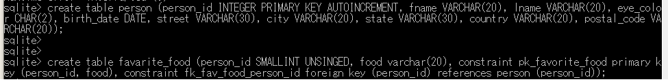

# 0. 好きな食べ物のデータベースを作成

人のテーブルを作成
<pre>
create table favarite_food (person_id SMALLINT UNSINGED, food varchar(20), constraint pk_favorite_food primary key (person_id, food), constraint fk_fav_food_person_id foreign key (person_id) references person (person_id));
</pre>

好物のテーブルを作成
<pre>
create table favarite_food (person_id SMALLINT UNSINGED, food varchar(20), constraint pk_favorite_food primary key (person_id, food), constraint fk_fav_food_person_id foreign key (person_id) references person (person_id));
</pre>

