# 0. 好きな食べ物のデータベースを作成


0.1 人のテーブルを作成
<pre>
create table person (person_id INTEGER PRIMARY KEY AUTOINCREMENT, fname VARCHAR(20), lname VARCHAR(20), birth_date DATE, street VARCHAR(30), city VARCHAR(20), state VARCHAR(30), country VARCHAR(20), postal_code VARCHAR(20));
</pre>

0.2 好物のテーブルを作成
<pre>
create table favarite_food (person_id SMALLINT UNSINGED, food varchar(20), constraint pk_favorite_food primary key (person_id, food), constraint fk_fav_food_person_id foreign key (person_id) references person (person_id));
</pre>


0.3 Sato Hanakoさんのデータを格納
<pre>
insert into person (fname, lname, eye_color, birth_date) values('hanako', 'sato', 'BR', '1972-10-27');
</pre>

0.4 Taro Yamadaさんのデータを格納
<pre>
insert into person (fname, lname, eye_color, birth_date) values('taro', 'yamada', 'BR', '1972-05-27');
</pre>

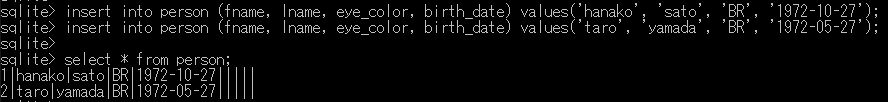

0.5 Sato Hanakoさんのデータに住所の情報を追加

<pre>
update person set street='minamisenju 17', city='arakawa-ku', state='tokyo', country='japan', postal_code = '1160003' where person_id = 1;
</pre>

0.6 TaroさんとHanakoさんの好物を追加

<pre>
insert into favarite_food (person_id, food) values (1, 'pizza');
insert into favarite_food (person_id, food) values (1, 'soba');
insert into favarite_food (person_id, food) values (2, 'ramen');
</pre>

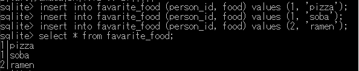

0.7 住所のテーブルと好物のテーブルをperson_idで結合する

<pre>
select p.fname, p.lname, p.birth_date, favarite_food.food from person p inner join favarite_food on p.person_id = favarite_food.person_id;
</pre>

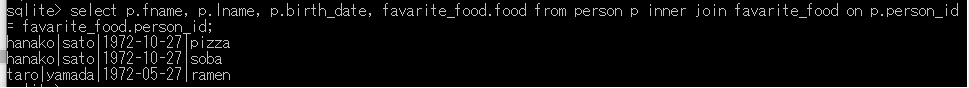

<hr>

0.8 バッチで一括実行

1.bat 

<pre>
sqlite3 cit-7.db "drop table person;"

sqlite3 cit-7.db "create table person (person_id INTEGER PRIMARY KEY AUTOINCREMENT, fname VARCHAR(20), lname VARCHAR(20), eye_color CHAR(2), birth_date DATE, street VARCHAR(30), city VARCHAR(20), state VARCHAR(30), country VARCHAR(20), postal_code VARCHAR(20));"

sqlite3 cit-7.db "create table favarite_food (person_id SMALLINT UNSINGED, food varchar(20), constraint pk_favorite_food primary key (person_id, food), constraint fk_fav_food_person_id foreign key (person_id) references person (person_id));"

sqlite3 cit-7.db "insert into person (person_id, fname, lname, eye_color, birth_date) values('1', 'taro', 'yamada', 'BR', '1972-05-27');"

sqlite3 cit-7.db "insert into person (person_id, fname, lname, eye_color, birth_date) values('2', 'hanako', 'sato', 'BR', '1972-10-27');"

sqlite3 cit-7.db "update person set street='minamisenju 17', city='arakawa-ku', state='tokyo', country='japan', postal_code = '1160003' where person_id = 1;"

sqlite3 cit-7.db "insert into favarite_food (person_id, food) values (1, 'pizza');"

sqlite3 cit-7.db "insert into favarite_food (person_id, food) values (1, 'soba');"

sqlite3 cit-7.db "insert into favarite_food (person_id, food) values (2, 'ramen');"

sqlite3 cit-7.db "select p.person_id, p.fname, p.lname, p.birth_date, p.eye_color, p.state, p.city, p.street, favarite_food.food from person p inner join favarite_food on p.person_id = favarite_food.person_id;"
</pre>

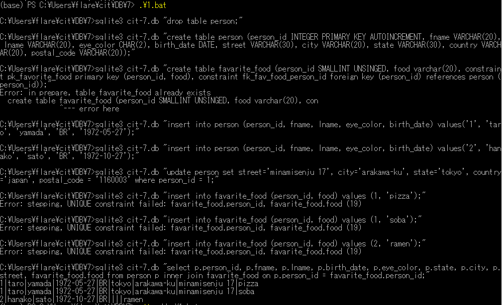

# 1. ゲームのステータス画面のDB設計


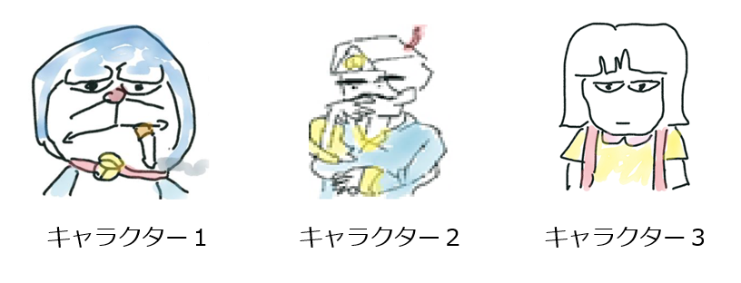

1.1 プレイヤーのテーブルを作成する

<pre>
create table player (person_id INTEGER PRIMARY KEY AUTOINCREMENT, fname VARCHAR(20), lname VARCHAR(20), points INTEGER, rank VARCHAR(20));
</pre>

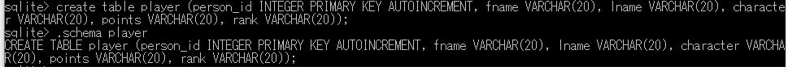

1.2 キャラクタのテーブルを作成する

<pre>
create table character (person_id INTEGER, character_id INTEGER, character_name VARCHAR(20), HP INTERGER, MP INTEGER, EXP INTEGER);
</pre>

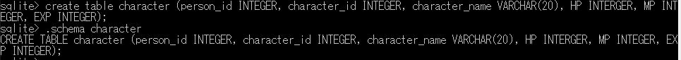

1.3 プレイヤー情報の登録
<pre>
insert into player (fname, lname, points, rank) values('taro', 'yamada', '0', 'D');
insert into player (fname, lname, points, rank) values('hanako', 'sato', '0', 'D');        
</pre>

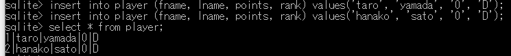

1.4 キャラクタ情報の登録
<pre>
insert into character (person_id, character_id, character_name, HP, MP, EXP) values(1, 1, 'doraemon', 10, 10, 0)
insert into character (person_id, character_id, character_name, HP, MP, EXP) values(2, 2, 'akinator', 15, 5, 0);
</pre>

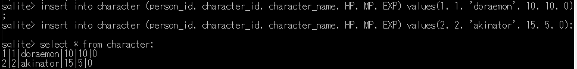

1.5 キャラクタの値を更新
<pre>
update character set HP=5, MP=10, EXP=5 where character_id = 1;
</pre>
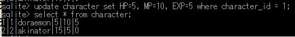

1.6 更新されたプレイヤーのステータス情報のテーブルを作る

<pre>
select p.fname, p.lname, points, rank, character.character_name, character.HP, character.MP, character.EXP from player p inner join character on p.person_id = character.person_id;
</pre>

<hr>
1.7 バッチで一括実行

2.bat
<pre>
sqlite3 cit-7.db "drop table player;"
sqlite3 cit-7.db "drop table character;"

sqlite3 cit-7.db "create table player (person_id INTEGER PRIMARY KEY AUTOINCREMENT, fname VARCHAR(20), lname VARCHAR(20), points INTEGER, rank VARCHAR(20));"

sqlite3 cit-7.db "create table character (person_id INTEGER, character_id INTEGER, character_name VARCHAR(20), HP INTERGER, MP INTEGER, EXP INTEGER);"

sqlite3 cit-7.db "insert into player (fname, lname, points, rank) values('taro', 'yamada', '0', 'D');"
sqlite3 cit-7.db "insert into player (fname, lname, points, rank) values('hanako', 'sato', '0', 'D');"  

sqlite3 cit-7.db "insert into character (person_id, character_id, character_name, HP, MP, EXP) values(1, 1, 'doraemon', 10, 10, 0);"
sqlite3 cit-7.db "insert into character (person_id, character_id, character_name, HP, MP, EXP) values(2, 2, 'akinator', 15, 5, 0);"

sqlite3 cit-7.db "select p.fname, p.lname, points, rank, character.character_name, character.HP, character.MP, character.EXP from player p inner join character on p.person_id = character.person_id;"

sqlite3 cit-7.db "update character set HP=5, MP=10, EXP=5 where character_id = 1;"

sqlite3 cit-7.db "select p.fname, p.lname, points, rank, character.character_name, character.HP, character.MP, character.EXP from player p inner join character on p.person_id = character.person_id;
</pre>

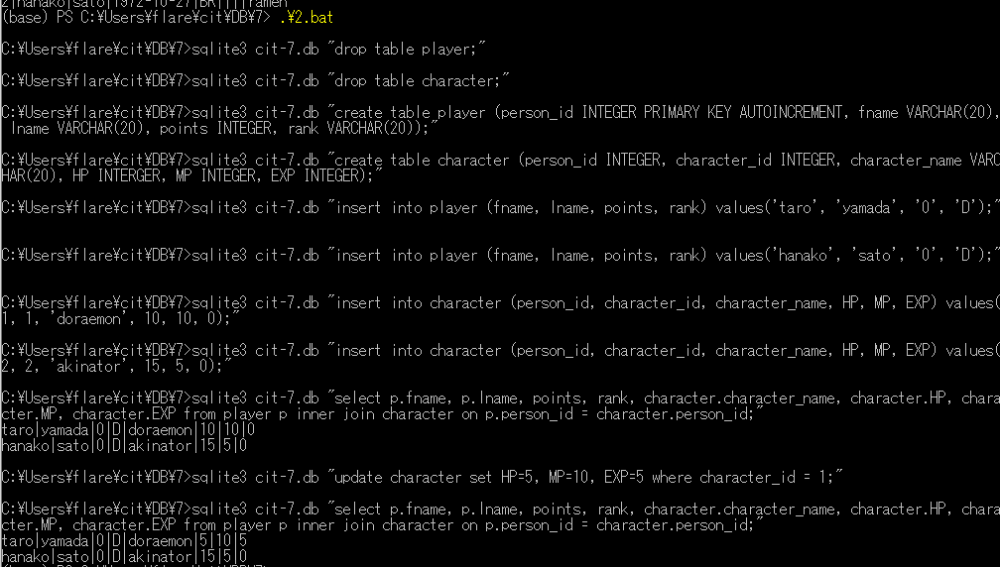

<hr>
1.8 pythonからSQL実行

1.8.1 playerのテーブルを作成

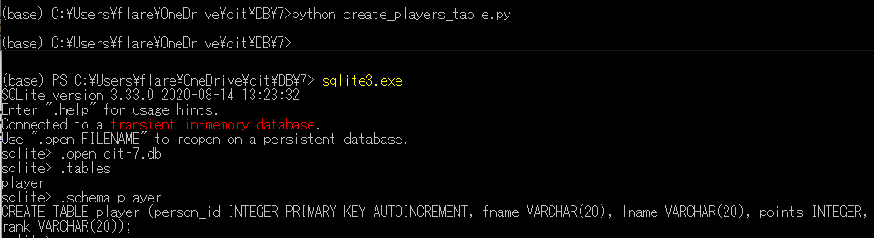

1.8.2 characterのテーブルを作成

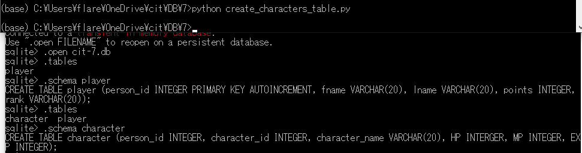

1.8.3 ランダムにHPとMPを変化させる - update.py

```python
#!/usr/bin/env python
# -*- coding: utf-8 -*-

import sqlite3
import random

dbname = 'cit-7.db'
# 1.データベースに接続
conn = sqlite3.connect(dbname)

# 2.sqliteを操作するカーソルオブジェクトを作成
cur = conn.cursor()

HP = random.randint(0, 20)
MP = random.randint(0, 20)
comstr = "update character set HP=" + str(HP) + ", MP=" + str(MP) + ", EXP=5 where character_id = 1;"

# 3.
cur.execute(comstr)

HP = random.randint(0, 20)
MP = random.randint(0, 20)
comstr = "update character set HP=" + str(HP) + ", MP=" + str(MP) + ", EXP=5 where character_id = 2;"

cur.execute(comstr)

# 4.データベースにデータをコミット
conn.commit()

# 5.データベースの接続を切断
cur.close()
conn.close()
```

1.8.2 show.py

```python
#!/usr/bin/env python
# -*- coding: utf-8 -*-

import sqlite3

dbname = 'cit-7.db'
# 1.データベースに接続
conn = sqlite3.connect(dbname)

# 2.sqliteを操作するカーソルオブジェクトを作成zuwo
cur = conn.cursor()

# 3.
cur.execute('select * from character;')
for row in cur:
    print(row)

# 4.データベースにデータをコミット
conn.commit()

# 5.データベースの接続を切断
cur.close()
conn.close()
```

1.8.3 通しで実行してみる

<ing src="python-through.png">


1.9 ER図を書いてまとめる

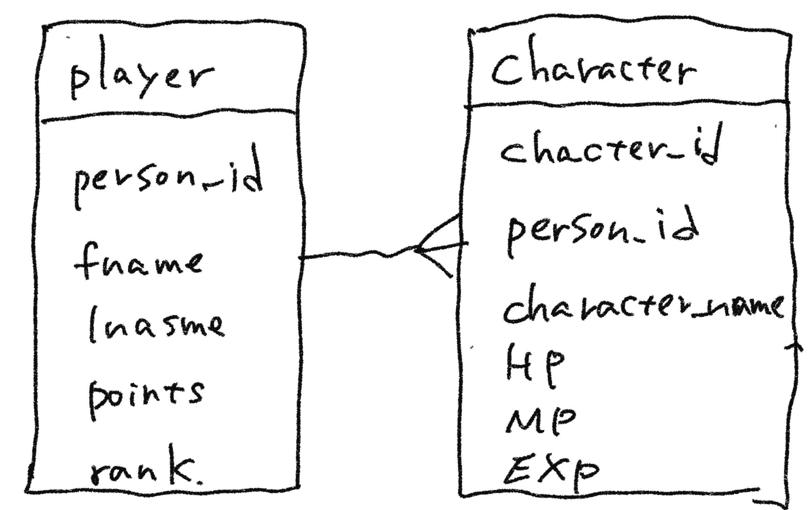
