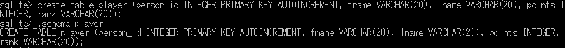

# 0. 好きな食べ物のデータベースを作成

0.1 人のテーブルを作成
<pre>
create table favarite_food (person_id SMALLINT UNSINGED, food varchar(20), constraint pk_favorite_food primary key (person_id, food), constraint fk_fav_food_person_id foreign key (person_id) references person (person_id));
</pre>

0.2 好物のテーブルを作成
<pre>
create table favarite_food (person_id SMALLINT UNSINGED, food varchar(20), constraint pk_favorite_food primary key (person_id, food), constraint fk_fav_food_person_id foreign key (person_id) references person (person_id));
</pre>

0.3 Sato Hanakoさんのデータを格納
<pre>
insert into person (fname, lname, eye_color, birth_date) values('hanako', 'sato', 'BR', '1972-10-27');
</pre>

0.4 Taro Yamadaさんのデータを格納
<pre>
insert into person (fname, lname, eye_color, birth_date) values('taro', 'yamada', 'BR', '1972-05-27');
</pre>

0.5 Sato Hanakoさんのデータに住所の情報を追加

<pre>
update person set street='minamisenju 17', city='arakawa-ku', state='tokyo', country='japan', postal_code = '1160003' where person_id = 1;
</pre>

0.6 TaroさんとHanakoさんの好物を追加

<pre>
insert into favarite_food (person_id, food) values (1, 'pizza');
insert into favarite_food (person_id, food) values (1, 'soba');
insert into favarite_food (person_id, food) values (2, 'ramen');
</pre>

0.7 住所のテーブルと好物のテーブルをperson_idで結合する

<pre>
select p.fname, p.lname, p.birth_date, favarite_food.food from person p inner join favarite_food on p.person_id = favarite_food.person_id;
</pre>

# 1. ゲームのステータス画面のDB設計

1.1 プレイヤーのテーブルを作成する

<pre>
create table player (person_id INTEGER PRIMARY KEY AUTOINCREMENT, fname VARCHAR(20), lname VARCHAR(20), points INTEGER, rank VARCHAR(20));
</pre>

1.2 キャラクタのテーブルを作成する

<pre>
create table character (person_id INTEGER, character_id INTEGER, character_name VARCHAR(20), HP INTERGER, MP INTEGER, EXP INTEGER);
</pre>

1.3 プレイヤー情報の登録
<pre>
insert into player (fname, lname, points, rank) values('taro', 'yamada', '0', 'D');
insert into player (fname, lname, points, rank) values('hanako', 'sato', '0', 'D');        
</pre>

1.4 キャラクタ情報の登録
<pre>
insert into character (person_id, character_id, character_name, HP, MP, EXP) values(1, 1, 'doraemon', 10, 10, 0)
insert into character (person_id, character_id, character_name, HP, MP, EXP) values(2, 2, 'akinator', 15, 5, 0);
</pre>

1.5 キャラクタの値を更新
<pre>
update character set HP=5, MP=10, EXP=5 where character_id = 1;
</pre>

1.6 更新されたプレイヤーのステータス情報のテーブルを作る

<pre>
select p.fname, p.lname, points, rank, character.character_name, character.HP, character.MP, character.EXP from player p inner join character on p.person_id = character.person_id;
</pre>

