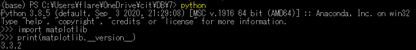
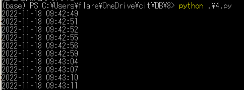
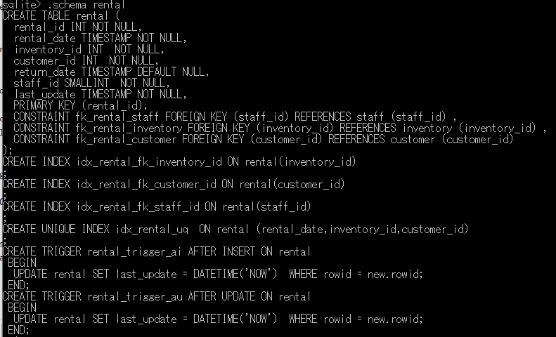
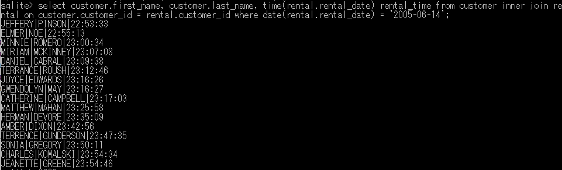

# 0. matplotlib



# 1. ランダムに現在時刻を表示する

```
import time
import random
import datetime


for number in range(10):

	dt_now = datetime.datetime.now()
	print(dt_now.strftime('%Y-%m-%d %H:%M:%S'))

	waitsec=random.randint(1,5)
	time.sleep(waitsec)
```



# 2. sakira_dbの時系列データを見てみる

<pre>
sqlite> .open sakila_master.db
sqlite> .schema rental
</pre>



<pre>
sqlite> select * from rental limit 5;
1|2005-05-24 22:53:30.000|367|130|2005-05-26 22:04:30.000|1|2020-12-23 07:15:20
2|2005-05-24 22:54:33.000|1525|459|2005-05-28 19:40:33.000|1|2020-12-23 07:15:20
3|2005-05-24 23:03:39.000|1711|408|2005-06-01 22:12:39.000|1|2020-12-23 07:15:20
4|2005-05-24 23:04:41.000|2452|333|2005-06-03 01:43:41.000|2|2020-12-23 07:15:20
5|2005-05-24 23:05:21.000|2079|222|2005-06-02 04:33:21.000|1|2020-12-23 07:15:20
</pre>

<pre>
sqlite> select customer.first_name, customer.last_name, time(rental.rental_date) rental_time from customer inner join rental on customer.customer_id = rental.customer_id where date(rental.rental_date) = '2005-06-14';
</pre>


