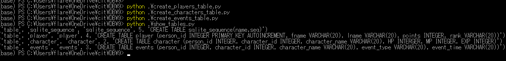

# 0.テーブルを作成する

<pre>
(base) PS C:\Users\flare\OneDrive\cit\DB\9> python .\create_players_table.py
(base) PS C:\Users\flare\OneDrive\cit\DB\9> python .\create_characters_table.py
(base) PS C:\Users\flare\OneDrive\cit\DB\9> python .\create_events_table.py
(base) PS C:\Users\flare\OneDrive\cit\DB\9> python .\show_tables.py
</pre>

