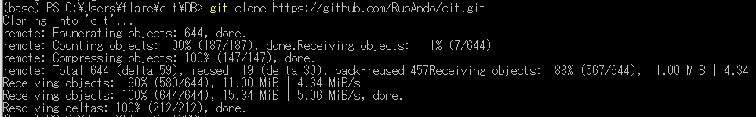
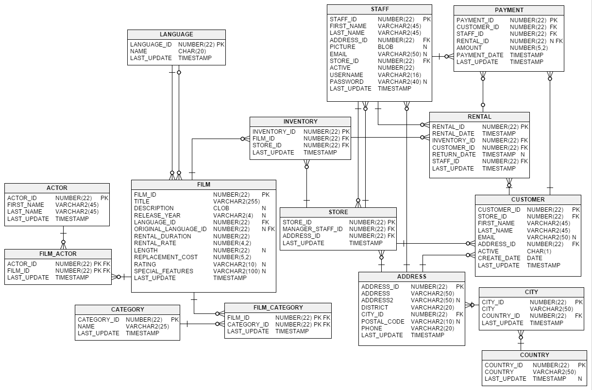

# 1. git.exeのダウンロード

<pre>
https://github.com/RuoAndo/cit/blob/main/DB/git.exe
</pre>

下記のコマンドを実行
<pre>
(base) PS C:\Users\flare\cit\DB> git clone https://github.com/RuoAndo/cit.git
</pre>

# 2. Sakila-DB

#3. Tableの作成

<pre>
sqlite> create table person
   ...> (person_id SMALLINT UNSIGNED,
   ...> fname VARCHAR(20),
   ...> lname VARCHAR(20),
   ...> eye_color CHAR(2),
   ...> birth_date DATE,
   ...> street VARCHAR(30),
   ...> city VARCHAR(20),
   ...> street VARCHAR(30),
   ...> country VARCHAR(20),
   ...> postal_code VARCHAR(20),
   ...> CONSTRAINT pk_person PRIMARY KEY (person_id)
   ...> );
 </pre>

<pre>
create table person (person_id INTEGER PRIMARY KEY AUTOINCREMENT, fname VARCHAR(20), lname VARCHAR(20), eye_color CHAR(2), birth_date DATE, street VARCHAR(30), city VARCHAR(20), state VARCHAR(30), country VARCHAR(20), postal_code VARCHAR(20));
</pre>

 
