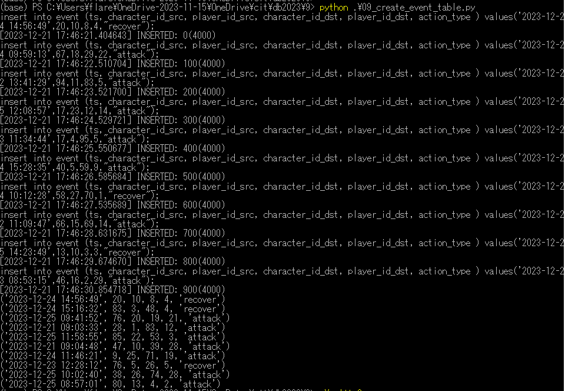
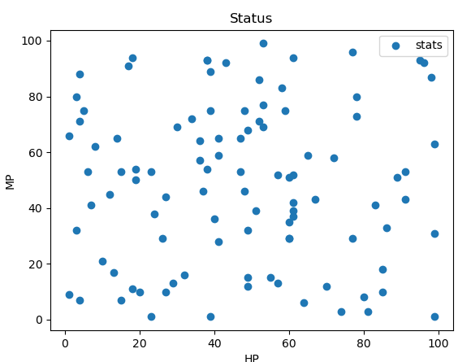
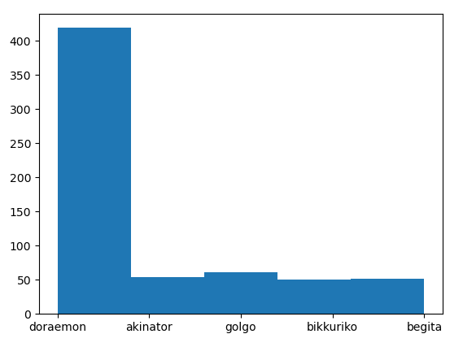
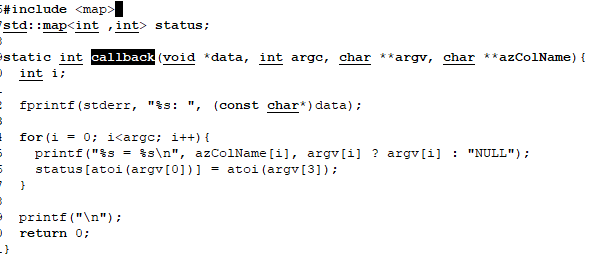
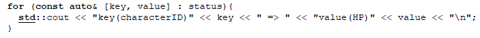
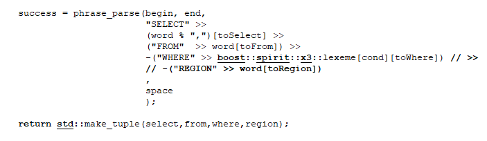
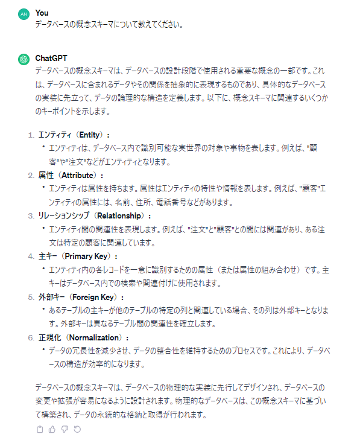
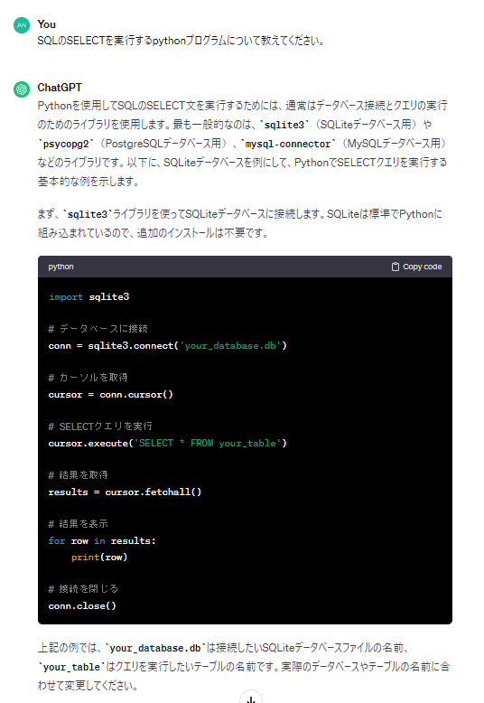

pythonのバージョン確認 (3.6以上であること）
<pre>
# python --version                                                                                                                                                                                  Python 3.6.3
</pre>
# 0. データベースcit-db-2023-10.dbの作成
0.1 下記の３つのプログラムを実行
<pre>
-a---l        2023/12/23     16:26           2143 10_create_event_table.py
-a---l        2023/12/23     16:37           1572 10_insert_character_repeat_weighted.py
-a---l        2023/12/23     16:37           1584 10_insert_player_repeat.py
</pre>
またはgenerate.batを実行
<pre>
(base) PS C:\Users\flare\OneDrive-2023-11-15\OneDrive\cit\db2023\10> .\generate.bat
</pre>
</pe>
<pre>
ts TIMESTAMP,  : タイムスタンプ
character_id_src INTEGER,  : アクション元のキャラクターID
player_id_src INTEGER, : アクション元のプレイヤーID
character_id_dst INTEGER, ： アクション先のキャラクターID
player_id_dst INTEGER, ：　アクション先のキャラクターID
action_type VARCHAR(20)　：　アクション種別「攻撃」「防御」
</pre>
<pre>
(base) PS C:\Users\flare\OneDrive-2023-11-15\OneDrive\cit\db2023\9> .\sqlite3.exe .\cit-db-2023-09.db
SQLite version 3.39.3 2022-09-05 11:02:23
Enter ".help" for usage hints.
sqlite> .tables
event
sqlite> .schema event
CREATE TABLE event (ts TIMESTAMP, character_id_src INTEGER, player_id_src INTEGER, character_id_dst INTEGER, player_id_dst INTEGER, action_type VARCHAR(20));
</pre>

0.2 一番攻撃を受けているCharacter_IDを検索
<pre>
sqlite> SELECT character_id_dst, count(*) FROM event GROUP BY character_id_dst ORDER BY COUNT(*) DESC LIMIT 5;
15|19
77|17
49|17
94|16
54|16
</pre>

0.3 攻撃を受けたCharacterの履歴と攻撃件数を表示
<pre>
SELECT E.ts, C.character_name FROM event E INNER JOIN character C ON E.character_id_dst == C.character_id WHERE E.action_type == \'attack\'
</pre>
pythonプログラムでカウント
<pre>
(base) PS C:\Users\flare\OneDrive-2023-11-15\OneDrive\cit\db2023\9> python .\10_select_01.py
('2023-12-25 13:48:16', 'bikkuriko')
('2023-12-25 12:34:08', 'bikkuriko')
('2023-12-27 09:29:58', 'begita')
('2023-12-24 10:57:28', 'doraemon')
('2023-12-25 11:11:57', 'doraemon')
636
</pre>
636件

# 1. SQLから統計量を計算
1.1 HP, MPの分布を作成
<pre>
sqlite> .headers on
sqlite> .mode csv
sqlite> .once 10_1.csv
sqlite> SELECT HP, MP from character;
</pre>
<pre>
(base) PS C:\Users\flare\OneDrive-2023-11-15\OneDrive\cit\db2023\9> head -n 5 .\10_1.csv
HP,MP
6,53
43,92
60,51
34,72
</pre>
<pre>
(base) PS C:\Users\flare\OneDrive-2023-11-15\OneDrive\cit\db2023\9> python .\10_scatter_HP_MP_2.py
</pre>

1.2 攻撃を受けたキャラクタのヒストグラムを作成
pythonメソッドを使う
<pre>
import collections
c = collections.Counter(dict_list)
</pre>
<pre>
(base) PS C:\Users\flare\OneDrive-2023-11-15\OneDrive\cit\db2023\9> python .\10_select_02.py
636
Counter({'doraemon': 419, 'golgo': 61, 'akinator': 54, 'begita': 52, 'bikkuriko': 50})
</pre>
<pre>
リストにplt.histメソッドを適用
(base) PS C:\Users\flare\OneDrive-2023-11-15\OneDrive\cit\db2023\9> python .\09_hist_01.py
636
</pre>

# 2. SQL実装1 DBからの出力をC++で処理する

2.1 characterID 1～99までの状態を表示
<pre>
# g++ 10_c_driver.cpp -lsqlite3 
</pre>
<pre>
Callback function called: character_id = 99
player_id = 5
character_name = doraemon
HP = 70
MP = 63
EXP = 96
</pre>

2.2 STL mapにcharacterIDとHPの組を格納
<pre>
# g++ 10_c_driver_2.cpp -lsqlite3
</pre>
<pre>
# ./a.out 
key(characterID)95 => value(HP)20
key(characterID)96 => value(HP)2
key(characterID)97 => value(HP)19
key(characterID)98 => value(HP)26
key(characterID)99 => value(HP)70
</pre>

解説: stl::mapをグローバルで定義して、コールバック関数内で格納

STLのイテレーションを使って処理 SQLのWHERE句やGROUP BYなどはSTLを使って実装できる

# 3. SQL実装2 SQL文のパース(semantic action)

g++のバージョン
<pre>
# g++ --version 
g++ (GCC) 8.2.0
</pre>

パースした結果をtupleに格納

<pre>
# g++ x3-sql-parser.cpp 
</pre>
下記のSELECT文をパースする
<pre>
"SELECT name FROM event WHERE character_id=3";
</pre>
<pre>
# ./a.out                                                                                                                                                                                         
fields name
from event
where character_id=3
</pre>

# 4. SQL文

# 5. 参考: ChatGPTを使う

<pre>
ChatGPT 3.5
https://chat.openai.com/
</pre>
Q1. データベースの概念スキーマについて教えてください。
<pre>
データベースの概念スキーマは、データベースの設計段階で使用される重要な概念の一部です。これは、データベースに含まれるデータやその関係を抽象的に表現するものであり、具体的なデータベースの実装に先立って、データの論理的な構造を定義します。以下に、概念スキーマに関連するいくつかのキーポイントを示します。

エンティティ（Entity）:

エンティティは、データベース内で識別可能な実世界の対象や事物を表します。例えば、"顧客"や"注文"などがエンティティとなります。
属性（Attribute）:

エンティティは属性を持ちます。属性はエンティティの特性や情報を表します。例えば、"顧客"エンティティの属性には、名前、住所、電話番号などがあります。
リレーションシップ（Relationship）:

エンティティ間の関連性を表現します。例えば、"注文"と"顧客"との間には関連があり、ある注文は特定の顧客に関連しています。
主キー（Primary Key）:

エンティティ内の各レコードを一意に識別するための属性（または属性の組み合わせ）です。主キーはデータベース内での検索や関連付けに使用されます。
外部キー（Foreign Key）:

あるテーブルの主キーが他のテーブルの特定の列と関連している場合、その列は外部キーとなります。外部キーは異なるテーブル間の関連性を確立します。
正規化（Normalization）:

データの冗長性を減少させ、データの整合性を維持するためのプロセスです。これにより、データベースの構造が効率的になります。
データベースの概念スキーマは、データベースの物理的な実装に先行してデザインされ、データベースの変更や拡張が容易になるように設計されます。物理的なデータベースは、この概念スキーマに基づいて構築され、データの永続的な格納と取得が行われます。
</pre>

Q2. SQLのSELECTを実行するpythonプログラムについて教えてください。

<pre>
Pythonを使用してSQLのSELECT文を実行するためには、通常はデータベース接続とクエリの実行のためのライブラリを使用します。最も一般的なのは、sqlite3（SQLiteデータベース用）やpsycopg2（PostgreSQLデータベース用）、mysql-connector（MySQLデータベース用）などのライブラリです。以下に、SQLiteデータベースを例にして、PythonでSELECTクエリを実行する基本的な例を示します。

まず、sqlite3ライブラリを使ってSQLiteデータベースに接続します。SQLiteは標準でPythonに組み込まれているので、追加のインストールは不要です。

import sqlite3
# データベースに接続
conn = sqlite3.connect('your_database.db')
# カーソルを取得
cursor = conn.cursor()
# SELECTクエリを実行
cursor.execute('SELECT * FROM your_table')
# 結果を取得
results = cursor.fetchall()
# 結果を表示
for row in results:
    print(row)
# 接続を閉じる
conn.close()

上記の例では、your_database.dbは接続したいSQLiteデータベースファイルの名前、your_tableはクエリを実行したいテーブルの名前です。実際のデータベースやテーブルの名前に合わせて変更してください。

データベースの種類や接続方法によっては、異なるライブラリや接続方法が必要です。例えば、PostgreSQLを使用する場合はpsycopg2ライブラリを、MySQLを使用する場合はmysql-connectorライブラリを使います。また、データベース接続情報（ホスト、ユーザー名、パスワードなど）を提供することも重要です。
</pre>

