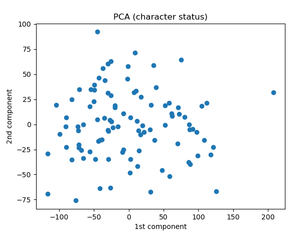
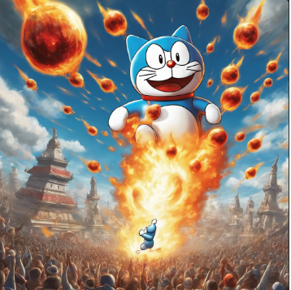
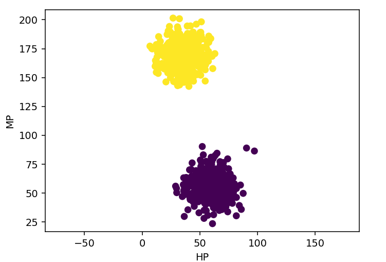

Player * 30

Character * 100

# 1. バッチファイル実行
<pre>
(base) PS C:\Users\flare\cit\db2023\12> .\generate2.bat
</pre>

# 2.（初期状態の）characterのステータス表示
<pre>
(base) PS C:\Users\flare\cit\db2023\12> python .\12_show_character_status.py
</pre>

# 3. eventの生成　(1,000イベント）
<pre>
(base) PS C:\Users\flare\cit\db2023\12> git add .\12_create_event_table_2.py
</pre>

# 4. （イベント発生後の）characterのステータス表示
<pre>
(base) PS C:\Users\flare\cit\db2023\12> python .\12_show_character_status.py
</pre>

# 5. 主成分分析をする（次元削減）
<pre>
(base) PS C:\Users\flare\cit\db2023\12> python .\12_PCA.py
            1          2          3
0 -104.596930  19.291158   3.880632
1   11.651858   3.395903 -43.801231
2  108.681233 -15.832426 -54.598074
3  -41.445048 -63.821884  -4.667005
4  -55.848510  17.699070 -35.793752
</pre>

第１，第２主成分をプロット

# 6. 特殊なイベントを生成する

Satble Diffusion: The evil-looking Doraemon is releasing a large number of fireballs from far up in the air.

全キャラクタのHPとMPの値を、強制的に次のような分布にする

