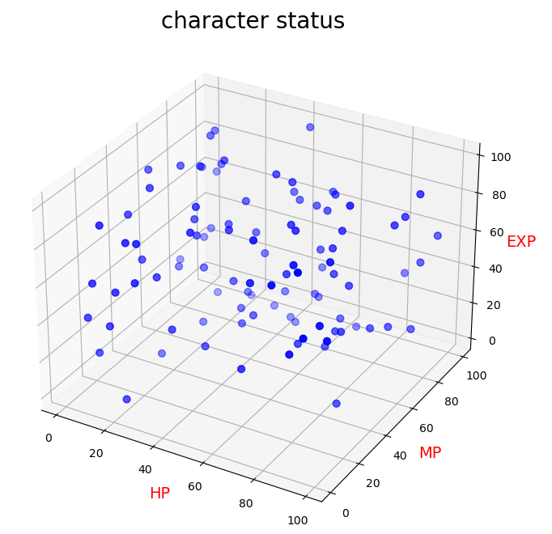
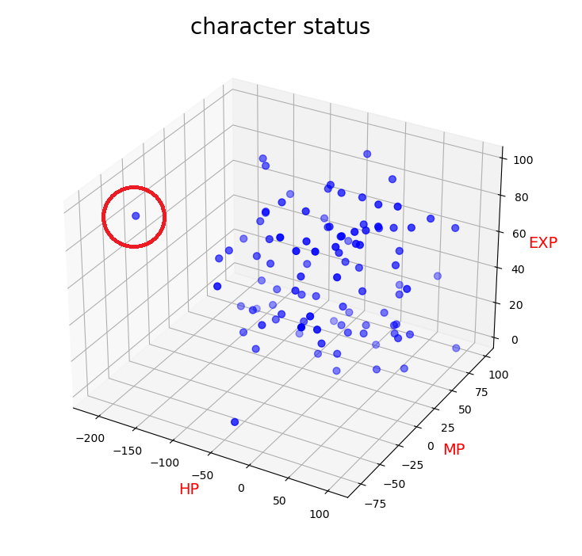

# バッチファイル実行
<pre>
(base) PS C:\Users\flare\cit\db2023\12> .\generate2.bat
</pre>

# （初期状態の）characterのステータス表示
<pre>
(base) PS C:\Users\flare\cit\db2023\12> python .\12_show_character_status.py
</pre>

# eventの生成　(1,000イベント）
<pre>
(base) PS C:\Users\flare\cit\db2023\12> git add .\12_create_event_table_2.py
</pre>

# （イベント発生後の）characterのステータス表示
<pre>
(base) PS C:\Users\flare\cit\db2023\12> python .\12_show_character_status.py
</pre>

