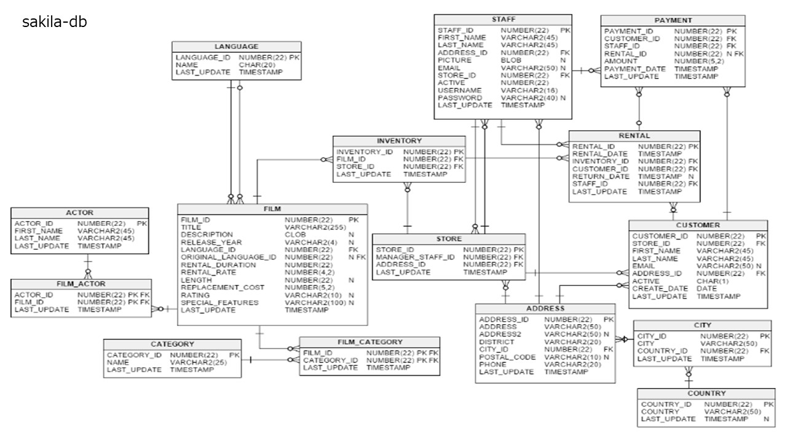

# 1. databaseを開く
<pre>
(base) PS C:\Users\flare\sqlite> .\sqlite3.exe .\sakila_master.db
SQLite version 3.39.3 2022-09-05 11:02:23
Enter ".help" for usage hints.
sqlite>
</pre>

# 2. tableの表示
<pre>
sqlite> .tables
actor                   film                    payment
address                 film_actor              rental
category                film_category           sales_by_film_category
city                    film_list               sales_by_store
country                 film_text               staff
customer                inventory               staff_list
customer_list           language                store
</pre>

# 3. actorのテーブルを見てみる
<pre>
sqlite> select * from actor limit 10;
1|PENELOPE|GUINESS|2020-12-23 07:12:29
2|NICK|WAHLBERG|2020-12-23 07:12:29
3|ED|CHASE|2020-12-23 07:12:29
4|JENNIFER|DAVIS|2020-12-23 07:12:29
5|JOHNNY|LOLLOBRIGIDA|2020-12-23 07:12:29
6|BETTE|NICHOLSON|2020-12-23 07:12:29
7|GRACE|MOSTEL|2020-12-23 07:12:29
8|MATTHEW|JOHANSSON|2020-12-23 07:12:29
9|JOE|SWANK|2020-12-23 07:12:29
10|CHRISTIAN|GABLE|2020-12-23 07:12:29
</pre>

# 課題. 在庫のテーブルから10件表示しなさい。
# 課題. actor_idが自分の出席番号が同じactorのfirst nameとlast nameを表示しなさい。

# 4. actorのschemaを調べる
<pre>
  sqlite> .schema actor
CREATE TABLE actor (
  actor_id numeric NOT NULL ,
  first_name VARCHAR(45) NOT NULL,
  last_name VARCHAR(45) NOT NULL,
  last_update TIMESTAMP NOT NULL,
  PRIMARY KEY  (actor_id)
  );
CREATE INDEX idx_actor_last_name ON actor(last_name)
;
CREATE TRIGGER actor_trigger_ai AFTER INSERT ON actor
 BEGIN
  UPDATE actor SET last_update = DATETIME('NOW')  WHERE rowid = new.rowid;
 END;
CREATE TRIGGER actor_trigger_au AFTER UPDATE ON actor
 BEGIN
  UPDATE actor SET last_update = DATETIME('NOW')  WHERE rowid = new.rowid;
 END;
</pre>

# 5. テーブルfilm_idとactorを結合する (内部結合）
<pre>
sqlite> SELECT actor.actor_id, first_name, last_name, film_id FROM actor INNER JOIN film_actor on actor.actor_id = film_actor.actor_id LIMIT 10;
1|PENELOPE|GUINESS|1
1|PENELOPE|GUINESS|23
1|PENELOPE|GUINESS|25
1|PENELOPE|GUINESS|106
1|PENELOPE|GUINESS|140
1|PENELOPE|GUINESS|166
1|PENELOPE|GUINESS|277
1|PENELOPE|GUINESS|361
1|PENELOPE|GUINESS|438
1|PENELOPE|GUINESS|499
</pre>

# 課題. filmとfilm_actorを内部結合し、下記のフィールドを表示しなさい。
<pre>
film.title
film.film_id
film_actor.actor_id
</pre>

# 課題. filmとfilm_actorを内部結合した課題1-3のテーブルから、actor_idが自分の出席番号の行を出力しなさい。

