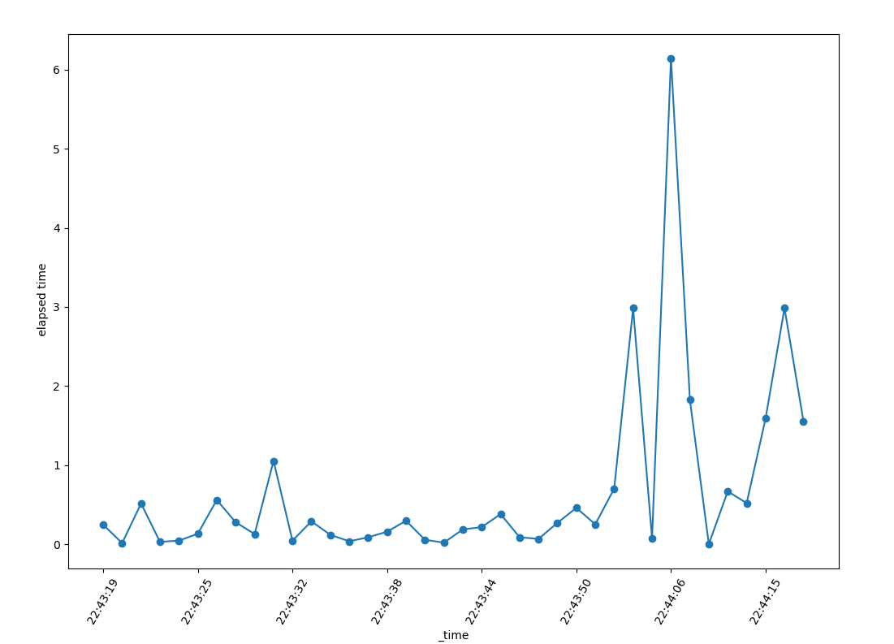
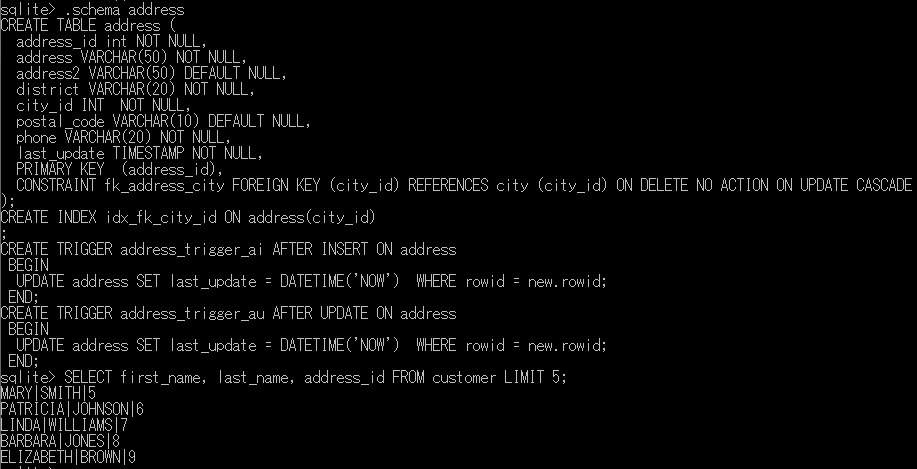
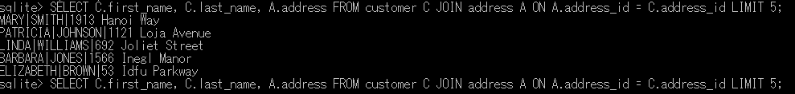
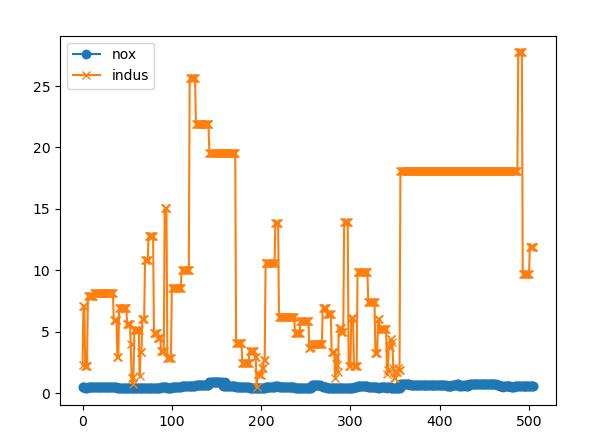
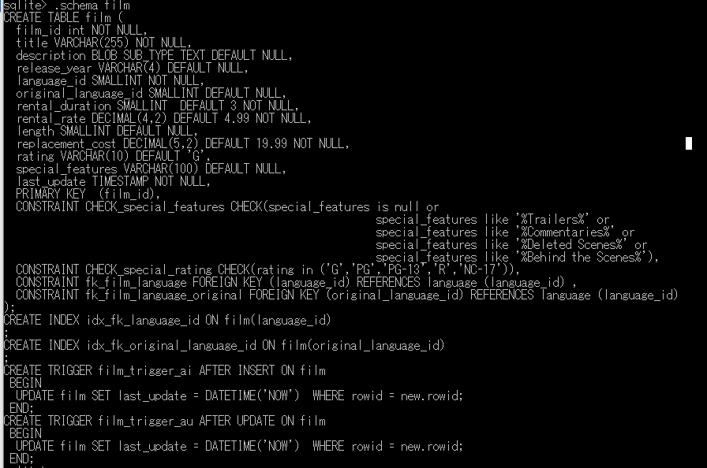
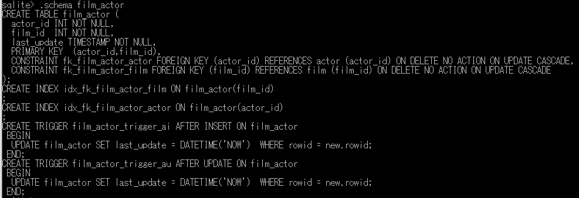
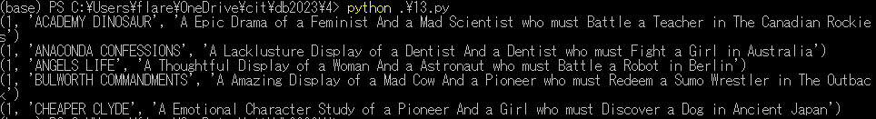

# 1. SELECTの実行時間を計測（シングルプロセス）

# 2. 内部結合 (INNER JOIN)
<pre>
sqlite> SELECT first_name, last_name, address_id FROM customer LIMIT 5;
</pre>

<pre>
sqlite> SELECT first_name, last_name, address_id FROM customer LIMIT 5;
</pre>

<pre>
JOIN  
sqlite> SELECT C.first_name, C.last_name, A.address FROM customer C JOIN address A ON A.address_id = C.address_id LIMIT 5;
</pre>

# 3. csvファイルのインポートとエクスポート
<pre>
sqlite> .mode csv
sqlite> .import ./BostonHousing.csv boston
sqlite> .headers on
sqlite> .mode csv
sqlite> .once exporttest.csv
sqlite> select crim,zn,indus,chas,nox,rm,age,dis from boston;
sqlite>
(base) PS C:\Users\flare\OneDrive\cit\db2023\4> more .\exporttest.csv
crim,zn,indus,chas,nox,rm,age,dis
0.00632,18,2.31,0,0.538,6.575,65.2,4.09
0.02731,0,7.07,0,0.469,6.421,78.9,4.9671
</pre>

# 4. データの抽出と可視化
<pre>
(base) PS C:\Users\flare\OneDrive\cit\db2023\4> python .\12.py
        crim    zn  indus  chas    nox     rm   age     dis
0    0.00632  18.0   2.31     0  0.538  6.575  65.2  4.0900
1    0.02731   0.0   7.07     0  0.469  6.421  78.9  4.9671
2    0.02729   0.0   7.07     0  0.469  7.185  61.1  4.9671
3    0.03237   0.0   2.18     0  0.458  6.998  45.8  6.0622
4    0.06905   0.0   2.18     0  0.458  7.147  54.2  6.0622
..       ...   ...    ...   ...    ...    ...   ...     ...
501  0.06263   0.0  11.93     0  0.573  6.593  69.1  2.4786
502  0.04527   0.0  11.93     0  0.573  6.120  76.7  2.2875
503  0.06076   0.0  11.93     0  0.573  6.976  91.0  2.1675
504  0.10959   0.0  11.93     0  0.573  6.794  89.3  2.3889
505  0.04741   0.0  11.93     0  0.573  6.030  80.8  2.5050
[506 rows x 8 columns]
</pre>

# 5. JOIN filmとfilm_actor

<pre>
sqlite> SELECT FA.actor_id, F.title, F.description FROM film_actor FA JOIN film F ON FA.film_id = F.film_id LIMIT 5;
1|ACADEMY DINOSAUR|A Epic Drama of a Feminist And a Mad Scientist who must Battle a Teacher in The Canadian Rockies
1|ANACONDA CONFESSIONS|A Lacklusture Display of a Dentist And a Dentist who must Fight a Girl in Australia
1|ANGELS LIFE|A Thoughtful Display of a Woman And a Astronaut who must Battle a Robot in Berlin
1|BULWORTH COMMANDMENTS|A Amazing Display of a Mad Cow And a Pioneer who must Redeem a Sumo Wrestler in The Outback
1|CHEAPER CLYDE|A Emotional Character Study of a Pioneer And a Girl who must Discover a Dog in Ancient Japan
sqlite> SELECT F.film_id, FA.actor_id, F.title, F.description FROM film_actor FA JOIN film F ON FA.film_id = F.film_id LIMIT 5;
1|1|ACADEMY DINOSAUR|A Epic Drama of a Feminist And a Mad Scientist who must Battle a Teacher in The Canadian Rockies
23|1|ANACONDA CONFESSIONS|A Lacklusture Display of a Dentist And a Dentist who must Fight a Girl in Australia
25|1|ANGELS LIFE|A Thoughtful Display of a Woman And a Astronaut who must Battle a Robot in Berlin
106|1|BULWORTH COMMANDMENTS|A Amazing Display of a Mad Cow And a Pioneer who must Redeem a Sumo Wrestler in The Outback
140|1|CHEAPER CLYDE|A Emotional Character Study of a Pioneer And a Girl who must Discover a Dog in Ancient Japan
</pre>

<pre>
pythonで実行し、結果をリストで取得。    
</pre>

#6 Group By
<pre>
sqlite> SELECT A.first_name, A.last_name, FA.actor_id, FA.film_id, count(*) FROM actor A JOIN film_actor FA ON A.actor_id = FA.actor_id GROUP BY A.first_name, A.last_name limit 5;
ADAM|GRANT|71|26|18
ADAM|HOPPER|132|81|22
AL|GARLAND|165|72|26
ALAN|DREYFUSS|173|49|27
ALBERT|JOHANSSON|146|12|33
</pre>
