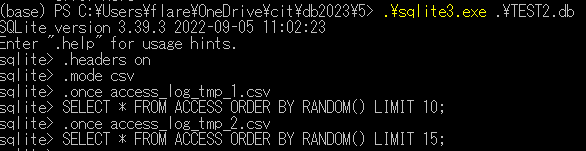
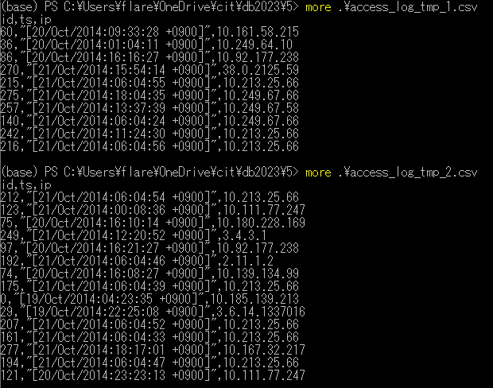

# 1. selectの処理時間を計測してプロット

# 2. actorとfilm_idを内部結合
<pre>
sqlite> SELECT actor.actor_id, first_name, last_name, film_id FROM actor JOIN film_actor ON actor.actor_id = film_actor.actor_id LIMIT 5;
1|PENELOPE|GUINESS|1
1|PENELOPE|GUINESS|23
1|PENELOPE|GUINESS|25
1|PENELOPE|GUINESS|106
1|PENELOPE|GUINESS|140
</pre>
  
# 3. actorとfilm_idを内部結合してランダムに5件表示

<pre>
sqlite> SELECT actor.actor_id, first_name, last_name, film_id FROM actor JOIN film_actor ON actor.actor_id = film_actor.actor_id ORDER BY RANDOM() LIMIT 5;
133|RICHARD|PENN|342
70|MICHELLE|MCCONAUGHEY|823
120|PENELOPE|MONROE|57
85|MINNIE|ZELLWEGER|421
188|ROCK|DUKAKIS|849
sqlite> SELECT actor.actor_id, first_name, last_name, film_id FROM actor JOIN film_actor ON actor.actor_id = film_actor.actor_id ORDER BY RANDOM() LIMIT 5;
94|KENNETH|TORN|712
155|IAN|TANDY|359
3|ED|CHASE|17
107|GINA|DEGENERES|162
181|MATTHEW|CARREY|286
</pre>

# 4. actorとfilm_idを内部結合して、actor名ごとにカウント（actorが出演している数を数える）

<pre>
sqlite> SELECT actor.actor_id, first_name, last_name, film_id, count(*) from actor JOIN film_actor ON actor.actor_id = film_actor.actor_id GROUP BY first_name HAVING count(*) > 1 LIMIT 5;
71|ADAM|GRANT|26|40
165|AL|GARLAND|72|26
173|ALAN|DREYFUSS|49|27
125|ALBERT|NOLTE|62|64
29|ALEC|WAYNE|10|29
</pre>

# 5. Access logをDBに格納
<pre>
(base) PS C:\Users\flare\OneDrive\cit\db2023\5> head -n 5 .\access_log.txt
10.185.139.213 - - [19/Oct/2014:04:23:35 +0900] "GET / HTTP/1.0" 200 20 "-" "Mozilla/5.0 (Windows NT 6.3; WOW64) AppleWebKit/537.36 (KHTML, like Gecko) Chrome/36.0.1985.143 Safari/537.36"
10.9.54.42 - - [19/Oct/2014:04:37:08 +0900] "GET /tmUnblock.cgi HTTP/1.1" 400 370 "-" "-"
10.249.79.66 - - [19/Oct/2014:05:38:39 +0900] "GET /robots.txt HTTP/1.1" 200 18 "-" "Mozilla/5.0 (compatible; Googlebot/2.1; +http://www.google.com/bot.html)"
10.249.79.50 - - [19/Oct/2014:05:38:39 +0900] "GET /~kawagoi/ical/ics/ical.php?ical=popopo.ics HTTP/1.1" 200 2627 "-" "Mozilla/5.0 (compatible; Googlebot/2.1; +http://www.google.com/bot.html)"
10.251.50.46 - - [19/Oct/2014:05:46:42 +0900] "CONNECT mx0.mail2000.com.tw:25 HTTP/1.0" 405 379 "-" "-"
</pre>

<pre>
(base) PS C:\Users\flare\OneDrive\cit\db2023\5> git add .\5-5.py
(base) PS C:\Users\flare\OneDrive\cit\db2023\5> .\sqlite3.exe .\TEST2.db
SQLite version 3.39.3 2022-09-05 11:02:23
Enter ".help" for usage hints.
sqlite> .tables
ACCESS
sqlite> SELECT * from ACCESS LIMIT 5;
0|[19/Oct/2014:04:23:35 +0900]|10.185.139.213
1|[19/Oct/2014:04:37:08 +0900]|36.0.1985.143
2|[19/Oct/2014:05:38:39 +0900]|10.9.54.42
3|[19/Oct/2014:05:38:39 +0900]|10.249.79.66
4|[19/Oct/2014:05:46:42 +0900]|10.249.79.50
</pre>

# 6. DBのアクセスログをcsvにエクスポート

# 7. Dataframe Union

6のデータをdataframeでunion (concat)

