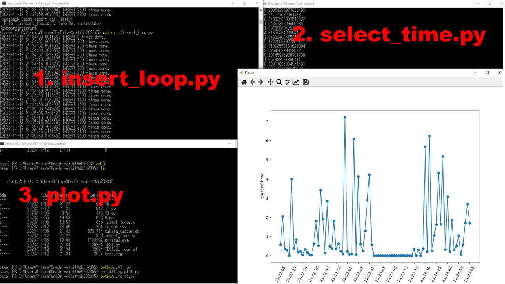

# 1. selectの処理時間を計測してプロット

# 2. actorとfilm_idを内部結合
<pre>
sqlite> SELECT actor.actor_id, first_name, last_name, film_id FROM actor JOIN film_actor ON actor.actor_id = film_actor.actor_id LIMIT 5;
1|PENELOPE|GUINESS|1
1|PENELOPE|GUINESS|23
1|PENELOPE|GUINESS|25
1|PENELOPE|GUINESS|106
1|PENELOPE|GUINESS|140
</pre>
  
<pre>
sqlite> SELECT actor.actor_id, first_name, last_name, film_id FROM actor JOIN film_actor ON actor.actor_id = film_actor.actor_id ORDER BY RANDOM() LIMIT 5;
133|RICHARD|PENN|342
70|MICHELLE|MCCONAUGHEY|823
120|PENELOPE|MONROE|57
85|MINNIE|ZELLWEGER|421
188|ROCK|DUKAKIS|849
sqlite> SELECT actor.actor_id, first_name, last_name, film_id FROM actor JOIN film_actor ON actor.actor_id = film_actor.actor_id ORDER BY RANDOM() LIMIT 5;
94|KENNETH|TORN|712
155|IAN|TANDY|359
3|ED|CHASE|17
107|GINA|DEGENERES|162
181|MATTHEW|CARREY|286
</pre>

# 2. actorとfilm_idを内部結合してランダムに５件表示
