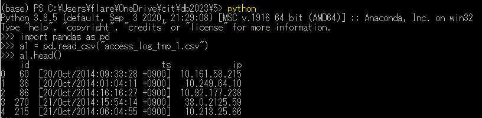

# 1. selectの処理時間を計測してプロット

# 2. actorとfilm_idを内部結合
<pre>
sqlite> SELECT actor.actor_id, first_name, last_name, film_id FROM actor JOIN film_actor ON actor.actor_id = film_actor.actor_id LIMIT 5;
1|PENELOPE|GUINESS|1
1|PENELOPE|GUINESS|23
1|PENELOPE|GUINESS|25
1|PENELOPE|GUINESS|106
1|PENELOPE|GUINESS|140
</pre>
  
# 3. actorとfilm_idを内部結合してランダムに5件表示

<pre>
sqlite> SELECT actor.actor_id, first_name, last_name, film_id FROM actor JOIN film_actor ON actor.actor_id = film_actor.actor_id ORDER BY RANDOM() LIMIT 5;
133|RICHARD|PENN|342
70|MICHELLE|MCCONAUGHEY|823
120|PENELOPE|MONROE|57
85|MINNIE|ZELLWEGER|421
188|ROCK|DUKAKIS|849
sqlite> SELECT actor.actor_id, first_name, last_name, film_id FROM actor JOIN film_actor ON actor.actor_id = film_actor.actor_id ORDER BY RANDOM() LIMIT 5;
94|KENNETH|TORN|712
155|IAN|TANDY|359
3|ED|CHASE|17
107|GINA|DEGENERES|162
181|MATTHEW|CARREY|286
</pre>

# 4. actorとfilm_idを内部結合して、actor名ごとにカウント（actorが出演している数を数える）

<pre>
sqlite> SELECT actor.actor_id, first_name, last_name, film_id, count(*) from actor JOIN film_actor ON actor.actor_id = film_actor.actor_id GROUP BY first_name HAVING count(*) > 1 LIMIT 5;
71|ADAM|GRANT|26|40
165|AL|GARLAND|72|26
173|ALAN|DREYFUSS|49|27
125|ALBERT|NOLTE|62|64
29|ALEC|WAYNE|10|29
</pre>

# 5. Access logをDBに格納
<pre>
(base) PS C:\Users\flare\OneDrive\cit\db2023\5> head -n 5 .\access_log.txt
10.185.139.213 - - [19/Oct/2014:04:23:35 +0900] "GET / HTTP/1.0" 200 20 "-" "Mozilla/5.0 (Windows NT 6.3; WOW64) AppleWebKit/537.36 (KHTML, like Gecko) Chrome/36.0.1985.143 Safari/537.36"
10.9.54.42 - - [19/Oct/2014:04:37:08 +0900] "GET /tmUnblock.cgi HTTP/1.1" 400 370 "-" "-"
10.249.79.66 - - [19/Oct/2014:05:38:39 +0900] "GET /robots.txt HTTP/1.1" 200 18 "-" "Mozilla/5.0 (compatible; Googlebot/2.1; +http://www.google.com/bot.html)"
10.249.79.50 - - [19/Oct/2014:05:38:39 +0900] "GET /~kawagoi/ical/ics/ical.php?ical=popopo.ics HTTP/1.1" 200 2627 "-" "Mozilla/5.0 (compatible; Googlebot/2.1; +http://www.google.com/bot.html)"
10.251.50.46 - - [19/Oct/2014:05:46:42 +0900] "CONNECT mx0.mail2000.com.tw:25 HTTP/1.0" 405 379 "-" "-"
</pre>

<pre>
(base) PS C:\Users\flare\OneDrive\cit\db2023\5> git add .\5-5.py
(base) PS C:\Users\flare\OneDrive\cit\db2023\5> .\sqlite3.exe .\TEST2.db
SQLite version 3.39.3 2022-09-05 11:02:23
Enter ".help" for usage hints.
sqlite> .tables
ACCESS
sqlite> SELECT * from ACCESS LIMIT 5;
0|[19/Oct/2014:04:23:35 +0900]|10.185.139.213
1|[19/Oct/2014:04:37:08 +0900]|36.0.1985.143
2|[19/Oct/2014:05:38:39 +0900]|10.9.54.42
3|[19/Oct/2014:05:38:39 +0900]|10.249.79.66
4|[19/Oct/2014:05:46:42 +0900]|10.249.79.50
</pre>

# 6. DBのアクセスログをcsvにエクスポート

# 7. Dataframe Union
6のデータをdataframeでunion (concat)

<pre>
>>> import pandas as pd
>>> a1 = pd.read_csv("access_log_tmp_1.csv")
>>> a1.head
<bound method NDFrame.head of     id                            ts             ip
0   60  [20/Oct/2014:09:33:28 +0900]  10.161.58.215
1   36  [20/Oct/2014:01:04:11 +0900]   10.249.64.10
2   86  [20/Oct/2014:16:16:27 +0900]  10.92.177.238
3  270  [21/Oct/2014:15:54:14 +0900]   38.0.2125.59
4  215  [21/Oct/2014:06:04:55 +0900]   10.213.25.66
5  275  [21/Oct/2014:18:04:35 +0900]   10.249.67.66
6  257  [21/Oct/2014:13:37:39 +0900]   10.249.67.58
7  140  [21/Oct/2014:06:04:24 +0900]   10.249.67.66
8  242  [21/Oct/2014:11:24:30 +0900]   10.213.25.66
9  216  [21/Oct/2014:06:04:56 +0900]   10.213.25.66>
>>> a2 = pd.read_csv("access_log_tmp_2.csv")
>>> a2.head
<bound method NDFrame.head of      id                            ts              ip
0   212  [21/Oct/2014:06:04:54 +0900]    10.213.25.66
1   123  [21/Oct/2014:00:08:36 +0900]   10.111.77.247
2    75  [20/Oct/2014:16:10:14 +0900]  10.180.228.169
3   249  [21/Oct/2014:12:20:52 +0900]         3.4.3.1
4    97  [20/Oct/2014:16:21:27 +0900]   10.92.177.238
5   192  [21/Oct/2014:06:04:46 +0900]        2.11.1.2
6    74  [20/Oct/2014:16:08:27 +0900]   10.139.134.99
7   175  [21/Oct/2014:06:04:39 +0900]    10.213.25.66
8     0  [19/Oct/2014:04:23:35 +0900]  10.185.139.213
9    29  [19/Oct/2014:22:25:08 +0900]  3.6.14.1337016
10  207  [21/Oct/2014:06:04:52 +0900]    10.213.25.66
11  161  [21/Oct/2014:06:04:33 +0900]    10.213.25.66
12  277  [21/Oct/2014:18:17:01 +0900]   10.167.32.217
13  194  [21/Oct/2014:06:04:47 +0900]    10.213.25.66
14  121  [20/Oct/2014:23:23:13 +0900]   10.111.77.247>
>>> a12 = pd.concat([a1,a2], ignore_header=True)
Traceback (most recent call last):
  File "<stdin>", line 1, in <module>
TypeError: concat() got an unexpected keyword argument 'ignore_header'
>>> a12 = pd.concat([a1,a2], ignore_index=True)
>>> a12.head  
</pre>

