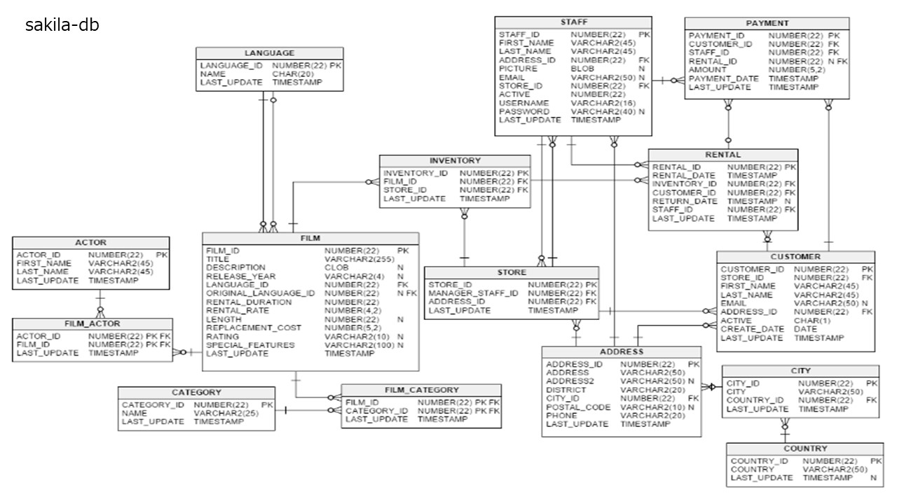
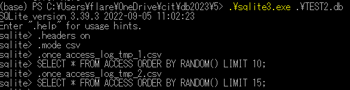
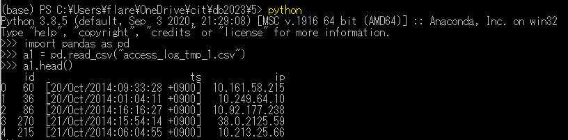

# 1. 第２正規形(2NF)の作成とCSVファイルへのエクスポート
1-1. filmテーブルの表示（5件表示）
<pre>
sqlite> SELECT film_id, title, description FROM film LIMIT 5;
1|ACADEMY DINOSAUR|A Epic Drama of a Feminist And a Mad Scientist who must Battle a Teacher in The Canadian Rockies
2|ACE GOLDFINGER|A Astounding Epistle of a Database Administrator And a Explorer who must Find a Car in Ancient China
3|ADAPTATION HOLES|A Astounding Reflection of a Lumberjack And a Car who must Sink a Lumberjack in A Baloon Factory
4|AFFAIR PREJUDICE|A Fanciful Documentary of a Frisbee And a Lumberjack who must Chase a Monkey in A Shark Tank
5|AFRICAN EGG|A Fast-Paced Documentary of a Pastry Chef And a Dentist who must Pursue a Forensic Psychologist in The Gulf of Mexico
</pre>
1-2. film_actorテーブルの表示（5件表示）
<pre>
sqlite> SELECT actor_id, film_id, last_update FROM film_actor LIMIT 5;
1|1|2020-12-23 07:13:43
1|23|2020-12-23 07:13:43
1|25|2020-12-23 07:13:43
1|106|2020-12-23 07:13:43
1|140|2020-12-23 07:13:43
</pre>
1-3. filmテーブルとfilm_actorを内部結合して5件表示
<pre>
sqlite> SELECT F.film_id, F.title, F.description, FA.actor_id, FA.last_update FROM film F JOIN film_actor FA ON F.film_id = FA.film_id LIMIT 5;
1|ACADEMY DINOSAUR|A Epic Drama of a Feminist And a Mad Scientist who must Battle a Teacher in The Canadian Rockies|1|2020-12-23 07:13:43
23|ANACONDA CONFESSIONS|A Lacklusture Display of a Dentist And a Dentist who must Fight a Girl in Australia|1|2020-12-23 07:13:43
25|ANGELS LIFE|A Thoughtful Display of a Woman And a Astronaut who must Battle a Robot in Berlin|1|2020-12-23 07:13:43
106|BULWORTH COMMANDMENTS|A Amazing Display of a Mad Cow And a Pioneer who must Redeem a Sumo Wrestler in The Outback|1|2020-12-23 07:13:43
140|CHEAPER CLYDE|A Emotional Character Study of a Pioneer And a Girl who must Discover a Dog in Ancient Japan|1|2020-12-23 07:13:43
</pre>
1.4 filmテーブルとfilm_actorを内部結合してCSVファイルにエクスポート(6_2NF_1.csv) 2NF:第2正規形
<pre>
(base) PS C:\Users\flare\OneDrive-2023-11-15\OneDrive\cit\db2023\6> .\sqlite3.exe .\sakila_master.db
SQLite version 3.39.3 2022-09-05 11:02:23
Enter ".help" for usage hints.
sqlite> .headers on
sqlite> .mode csv
sqlite> .once 6_2NF_1.csv
sqlite> SELECT F.film_id, F.title, F.description, FA.actor_id, FA.last_update FROM film F JOIN film_actor FA ON F.film_id = FA.film_id;
</pre>
1.5 作成したCSVファイルの内容を5件表示
<pre>
(base) PS C:\Users\flare\OneDrive-2023-11-15\OneDrive\cit\db2023\6> head -n 5 .\6_2NF_1.csv
film_id,title,description,actor_id,last_update
1,"ACADEMY DINOSAUR","A Epic Drama of a Feminist And a Mad Scientist who must Battle a Teacher in The Canadian Rockies",1,"2020-12-23 07:13:43"
23,"ANACONDA CONFESSIONS","A Lacklusture Display of a Dentist And a Dentist who must Fight a Girl in Australia",1,"2020-12-23 07:13:43"
25,"ANGELS LIFE","A Thoughtful Display of a Woman And a Astronaut who must Battle a Robot in Berlin",1,"2020-12-23 07:13:43"
106,"BULWORTH COMMANDMENTS","A Amazing Display of a Mad Cow And a Pioneer who must Redeem a Sumo Wrestler in The Outback",1,"2020-12-23 07:13:43"
</pre>

# 2. 第１正規形(1NF)の作成とCSVファイルへのエクスポート
2.1 CSVファイルから第２正規形のテーブルをインポートして、テーブルの名前をnf (normal form)として、内容を3件表示
<pre>
(base) PS C:\Users\flare\OneDrive-2023-11-15\OneDrive\cit\db2023\6> .\sqlite3.exe .\sakila_master.db
SQLite version 3.39.3 2022-09-05 11:02:23
Enter ".help" for usage hints.
sqlite> .mode csv
sqlite> .import 6_2NF_1.csv nf
sqlite> .schema nf
CREATE TABLE IF NOT EXISTS "nf"(
"film_id" TEXT, "title" TEXT, "description" TEXT, "actor_id" TEXT,
 "last_update" TEXT);
sqlite> select * from nf LIMIT 3;
1,"ACADEMY DINOSAUR","A Epic Drama of a Feminist And a Mad Scientist who must Battle a Teacher in The Canadian Rockies",1,"2020-12-23 07:13:43"
23,"ANACONDA CONFESSIONS","A Lacklusture Display of a Dentist And a Dentist who must Fight a Girl in Australia",1,"2020-12-23 07:13:43"
25,"ANGELS LIFE","A Thoughtful Display of a Woman And a Astronaut who must Battle a Robot in Berlin",1,"2020-12-23 07:13:43"
</pre>
2.2 インポートしたnfテーブルとactorテーブルと内部結合して第１正規形(1NF)を作成し、5件表示
<pre>
sqlite> SELECT A.actor_id, A.first_name, A.last_name, A.last_update, nf.film_id, nf.last_update, nf.title, nf.description FROM actor A JOIN nf ON A.actor_id = nf.actor_id LIMIT 5;
1,PENELOPE,GUINESS,"2020-12-23 07:12:29",1,"2020-12-23 07:13:43","ACADEMY DINOSAUR","A Epic Drama of a Feminist And a Mad Scientist who must Battle a Teacher in The Canadian Rockies"
1,PENELOPE,GUINESS,"2020-12-23 07:12:29",23,"2020-12-23 07:13:43","ANACONDA CONFESSIONS","A Lacklusture Display of a Dentist And a Dentist who must Fight a Girl in Australia"
1,PENELOPE,GUINESS,"2020-12-23 07:12:29",25,"2020-12-23 07:13:43","ANGELS LIFE","A Thoughtful Display of a Woman And a Astronaut who must Battle a Robot in Berlin"
1,PENELOPE,GUINESS,"2020-12-23 07:12:29",106,"2020-12-23 07:13:43","BULWORTH COMMANDMENTS","A Amazing Display of a Mad Cow And a Pioneer who must Redeem a Sumo Wrestler in The Outback"
1,PENELOPE,GUINESS,"2020-12-23 07:12:29",140,"2020-12-23 07:13:43","CHEAPER CLYDE","A Emotional Character Study of a Pioneer And a Girl who must Discover a Dog in Ancient Japan"
</pre>
2.3 作成した第１正規形(1NF)を、CSVファイルにエクスポート(6_1NF_1.csv)
<pre>
sqlite> .headers on
sqlite> .mode csv
sqlite> .once 6_1NF_1.csv
sqlite> SELECT A.actor_id, A.first_name, A.last_name, A.last_update, nf.film_id, nf.last_update, nf.title, nf.description FROM actor A JOIN nf ON A.actor_id = nf.actor_id;
</pre>
2.3 作成したCSVファイルの内容を5件表示
<pre>
(base) PS C:\Users\flare\OneDrive-2023-11-15\OneDrive\cit\db2023\6> head -n 5 .\6_1NF_1.csv
actor_id,first_name,last_name,last_update,film_id,last_update,title,description
1,PENELOPE,GUINESS,"2020-12-23 07:12:29",1,"2020-12-23 07:13:43","ACADEMY DINOSAUR","A Epic Drama of a Feminist And a Mad Scientist who must Battle a Teacher in The Canadian Rockies"
1,PENELOPE,GUINESS,"2020-12-23 07:12:29",23,"2020-12-23 07:13:43","ANACONDA CONFESSIONS","A Lacklusture Display of a Dentist And a Dentist who must Fight a Girl in Australia"
1,PENELOPE,GUINESS,"2020-12-23 07:12:29",25,"2020-12-23 07:13:43","ANGELS LIFE","A Thoughtful Display of a Woman And a Astronaut who must Battle a Robot in Berlin"
1,PENELOPE,GUINESS,"2020-12-23 07:12:29",106,"2020-12-23 07:13:43","BULWORTH COMMANDMENTS","A Amazing Display of a Mad Cow And a Pioneer who must Redeem a Sumo Wrestler in The Outback"
</pre>

# 3. 重複を取り除く DISTINCT
3.1 レンタルしている映画の中で、actorは何人いるのか数える
<pre>
sqlite> SELECT * FROM actor LIMIT 3;
1|PENELOPE|GUINESS|2020-12-23 07:12:29
2|NICK|WAHLBERG|2020-12-23 07:12:29
3|ED|CHASE|2020-12-23 07:12:29
sqlite> SELECT DISTINCT * FROM actor LIMIT 3;
1|PENELOPE|GUINESS|2020-12-23 07:12:29
2|NICK|WAHLBERG|2020-12-23 07:12:29
3|ED|CHASE|2020-12-23 07:12:29
sqlite> SELECT DISTINCT count(*) FROM actor;
200
</pre>
3.2 参考
<pre>
sqlite> SELECT * FROM actor LIMIT 1;
1|PENELOPE|GUINESS|2020-12-23 07:12:29
sqlite> SELECT * FROM film_actor LIMIT 1;
1|1|2020-12-23 07:13:43
sqlite> SELECT actor.actor_id,film_actor.film_id FROM actor JOIN film_actor ON actor.actor_id = film_actor.actor_id GROUP BY actor.actor_id LIMIT 5;
1|1
2|3
3|17
4|23
5|19
</pre>

# 4. 集計 GROUP BY
4-1. actorとfilm_actorを結合して、film_id -> actor_idの順番で表示
<pre>
sqlite> SELECT film_actor.film_id, film_actor.actor_id FROM actor JOIN film_actor ON actor.actor_id = film_actor.actor_id LIMIT 5;
1|1
23|1
25|1
106|1
140|1
</pre>
4-2. filmごとに、出演しているactorの数を数える
<pre>
sqlite> SELECT film_actor.film_id, film_actor.actor_id FROM actor JOIN film_actor ON actor.actor_id = film_actor.actor_id GROUP BY film_id LIMIT 5;
1|1
2|19
3|2
4|41
5|51
</pre>

# 5. 集計 GROUP BY と条件設定HAVING
actorが10人以上出演しているfilmを検索し、5件を表示
<pre>
sqlite> SELECT film_actor.film_id, film_actor.actor_id, count(*) FROM actor JOIN film_actor ON actor.actor_id = film_actor.actor_id GROUP BY film_id HAVING count(*) > 10 LIMIT 5;
34|12|12
87|3|13
146|5|13
188|31|13
249|2|13
</pre>

# 6. Dataframe 
<pre>
6.1 Union - 6のデータをdataframeでunion (concat)
</pre>

<pre>
>>> import pandas as pd
>>> a1 = pd.read_csv("access_log_tmp_1.csv")
>>> a1.head
<bound method NDFrame.head of     id                            ts             ip
0   60  [20/Oct/2014:09:33:28 +0900]  10.161.58.215
1   36  [20/Oct/2014:01:04:11 +0900]   10.249.64.10
2   86  [20/Oct/2014:16:16:27 +0900]  10.92.177.238
3  270  [21/Oct/2014:15:54:14 +0900]   38.0.2125.59
4  215  [21/Oct/2014:06:04:55 +0900]   10.213.25.66
5  275  [21/Oct/2014:18:04:35 +0900]   10.249.67.66
6  257  [21/Oct/2014:13:37:39 +0900]   10.249.67.58
7  140  [21/Oct/2014:06:04:24 +0900]   10.249.67.66
8  242  [21/Oct/2014:11:24:30 +0900]   10.213.25.66
9  216  [21/Oct/2014:06:04:56 +0900]   10.213.25.66>
>>> a2 = pd.read_csv("access_log_tmp_2.csv")
>>> a12 = pd.concat([a1,a2], ignore_index=True)
>>> a12.head  
</pre>

6.2 csvファイルを読み込んでデータセットを見る
<pre>
(base) PS C:\Users\flare\OneDrive-2023-11-15\OneDrive\cit\db2023\6> python
Python 3.8.5 (default, Sep  3 2020, 21:29:08) [MSC v.1916 64 bit (AMD64)] :: Anaconda, Inc. on win32
Type "help", "copyright", "credits" or "license" for more information.
>>> import pandas as pd
>>> data = pd.read_csv('state_population.csv')
>>> data.head()
  state/region     ages  year  population
0           AL  under18  2012   1117489.0
1           AL    total  2012   4817528.0
2           AL  under18  2010   1130966.0
3           AL    total  2010   4785570.0
4           AL  under18  2011   1125763.0
>>> data1 = pd.read_csv('state_areas.csv')
>>> data1.head()
        state  area (sq. mi)
0     Alabama          52423
1      Alaska         656425
2     Arizona         114006
3    Arkansas          53182
4  California         163707
>>> data2 = pd.read_csv('state_abbrevs.csv')
>>> data2.head()
        state abbreviation
0     Alabama           AL
1      Alaska           AK
2     Arizona           AZ
3    Arkansas           AR
4  California           CA
</pre>

6.3 datasetをキーを指定して結合(merge)
<pre>
>>> pd.merge(data1, data2, on='state')
                   state  area (sq. mi) abbreviation
0                Alabama          52423           AL
1                 Alaska         656425           AK
2                Arizona         114006           AZ
3               Arkansas          53182           AR
4             California         163707           CA
5               Colorado         104100           CO
6            Connecticut           5544           CT
</pre>
