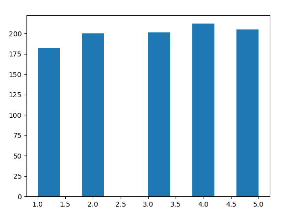
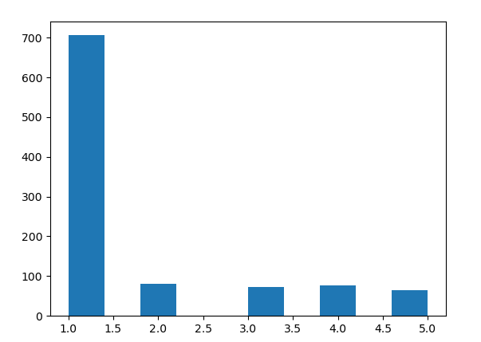

# 0. コンピュータのシステム負荷をデータベース化する

0.0 typeperfの実行
<pre>
https://pgecons-sec-tech.github.io/tech-report/html_wg3_windows_2018/wg3_windows_2018.html
</pre>

<pre>
(base) PS C:\Users\flare\OneDrive-2023-11-15\OneDrive\cit\db2023\7> typeperf.exe -cf list.txt -si 2 -sc 3
"(PDH-CSV 4.0)","\\DESKTOP-8FOAVTD\Processor(0)\% Processor Time","\\DESKTOP-8FOAVTD\Processor(1)\% Processor Time","\\DESKTOP-8FOAVTD\Processor(2)\% Processor Time","\\DESKTOP-8FOAVTD\Processor(3)\% Processor Time","\\DESKTOP-8FOAVTD\Processor(_Total)\% Processor Time","\\DESKTOP-8FOAVTD\Processor(0)\% User Time","\\DESKTOP-8FOAVTD\Processor(1)\% User Time","\\DESKTOP-8FOAVTD\Processor(2)\% User Time","\\DESKTOP-8FOAVTD\Processor(3)\% User Time","\\DESKTOP-8FOAVTD\Processor(_Total)\% User Time"
"11/23/2023 15:05:31.011","60.654237","54.096610","58.865794","60.058089","58.418685","38.749615","41.730354","48.287981","45.903390","43.667837"
"11/23/2023 15:05:33.029","14.770235","6.247259","12.445787","12.445787","11.477265","8.522976","3.099264","9.297793","6.198528","6.779638"
"11/23/2023 15:05:35.046","31.041321","17.869438","21.743521","22.518338","23.293155","13.946699","11.622249","16.271149","11.622249","13.365589"                        　　　　　　　　　　　　　　
コマンドは、正しく完了しました。
</pre>

0.1 csvファイルへダンプ（保存）
<pre>
(base) PS C:\Users\flare\OneDrive-2023-11-15\OneDrive\cit\db2023\7> typeperf.exe -cf list.txt -si 1 -sc 100 -o 1.csv
ファイル "1.csv" は、既に存在します。上書きしますか? [y/n] y
コマンドは、正しく完了しました。
</pre>

# 1.playerとcharacterのテーブルを作成

1.1 07_insert_player_repeat.pyと07_insert_character_repeat.pyを実行

<pre>
(base) C:\Users\flare\OneDrive-2023-11-15\OneDrive\cit\db2023>python 07_insert_player_repeat.py
insert into player (player_id, fname, lname, points, rank) values('0','yvKis','JMxwm','7','X');
insert into player (player_id, fname, lname, points, rank) values('1','okcGw','Vawbp','6','I');
</pre>

<pre>
(base) C:\Users\flare\OneDrive-2023-11-15\OneDrive\cit\db2023>python 07_insert_character_repeat.py  
</pre>

1.2 人気のcharacterを調べる

<pre>
sqlite> SELECT C.character_name, count(*) FROM player p INNER JOIN character C on P.player_id = C.player_id GROUP BY character_name ORDER BY count(*) DESC;
doraemon|217
akinator|215
golgo|197
bikkuriko|186
begita|185
</pre>

<pre>
(base) PS C:\Users\flare\OneDrive-2023-11-15\OneDrive\cit\db2023> .\sqlite3.exe .\cit-db-2023-07.db
SQLite version 3.39.3 2022-09-05 11:02:23
Enter ".help" for usage hints.
sqlite> SELECT C.character_name, count(*) FROM player p INNER JOIN character C on P.player_id = C.player_id GROUP BY character_name ORDER BY count(*) DESC;
bikkuriko|214
doraemon|210
akinator|210
golgo|186
begita|180
</pre>

1.3 乱数に偏りをもたせる

<pre>
import random
import matplotlib.pyplot as plt 

cycle = 1000

val_list = [1,2,3,4,5]
result_list = [random.choices(val_list)[0] for _ in range(cycle)]

print(result_list)

plt.hist(result_list)
plt.show()
</pre>

<pre>
import random
import matplotlib.pyplot as plt 

cycle = 1000

val_list = [1,2,3,4,5]
weight_list = [10,1,1,1,1]

result_list = [random.choices(val_list, weights=weight_list)[0] for _ in range(cycle)]
print(result_list)

plt.hist(result_list)
plt.show()
</pre>
  

1.4 doraemonに重みを付ける - 07_insert_character_repeat_weighted.pyを実行

<pre>
sqlite> SELECT C.character_name, count(*) FROM player p INNER JOIN character C on P.player_id = C.player_id GROUP BY character_name ORDER BY count(*) DESC;
doraemon|707
bikkuriko|89
begita|81
akinator|64
golgo|59
</pre>
