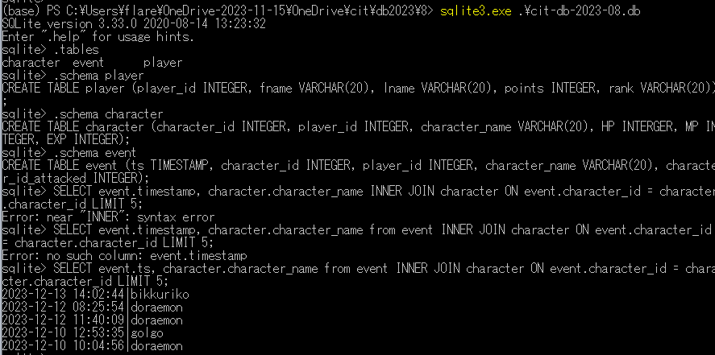
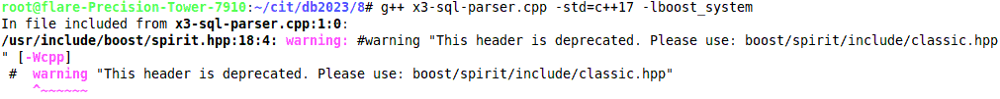
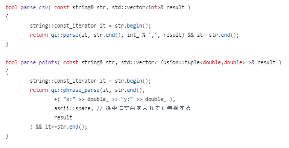
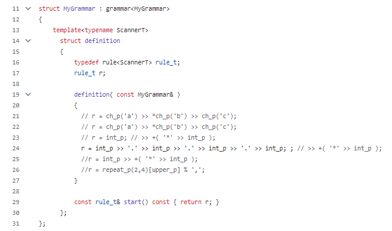

# 0. cit-db-2023-08.dbの作成
下記の３つのファイルを実行
<pre>
-a----        2023/12/09      9:45           1910 08_createEventTable.py
-a----        2023/12/09      9:28           1570 08_insert_character_repeat_weighted.py
-a----        2023/12/09      9:28           1567 08_insert_player_repeat.py
</pre>
テーブルの結合

# 1. Boost Spiript::X3でSQL文をparseする
<pre>
# g++ x3-sql-parser.cpp -std=c++17 -lboost_system
</pre>

<pre>
# ./a.out 
fields chr
fields pos
fields chrom
from variants
where chr=3 AND chr=4 
region exonic
</pre>

# 2. Semantic Action (boost spirit::qi)

<pre>
[root@ik1-314-17351 8]# time g++ csv_semantic_action.cpp                                                                                                                                                                                     

real    0m3.254s
user    0m3.042s
sys     0m0.205s
[root@ik1-314-17351 8]# ./a.out 
1,2,3
3 integers parsed
1 2 3
error
x: 1 y: 2.0 x: 3 y: -4.5
2 pts parsed
</pre>
  
# 3. Eventテーブルを作成
<pre>
(base) PS C:\Users\flare\OneDrive-2023-11-15\OneDrive\cit\db2023\8> python .\08_createEventTable.py
INSERTED: 0
INSERTED: 100
INSERTED: 200
INSERTED: 300
INSERTED: 400
INSERTED: 500
INSERTED: 600
INSERTED: 700
INSERTED: 800
INSERTED: 900
('2023-12-10 14:51:06', 19, 13, 'doraemon', 94)
('2023-12-10 11:54:29', 62, 14, 'bikkuriko', 22)
('2023-12-10 15:03:24', 35, 2, 'begita', 23)
('2023-12-09 09:46:48', 47, 2, 'doraemon', 91)
('2023-12-09 10:13:20', 9, 16, 'doraemon', 42)
('2023-12-10 08:17:57', 90, 25, 'doraemon', 57)
('2023-12-13 15:42:12', 85, 15, 'doraemon', 89)
('2023-12-09 09:13:49', 45, 3, 'doraemon', 75)
('2023-12-13 11:07:19', 33, 17, 'doraemon', 9)
('2023-12-11 13:51:29', 91, 13, 'doraemon', 2)
</pre>
2023-12-12に発生したイベントを見る
<pre>
sqlite> select * from event where date(ts) == '2023-12-12' LIMIT 5;
2023-12-12 08:24:50|68|20|doraemon|45
2023-12-12 14:05:38|50|23|doraemon|93
2023-12-12 10:56:05|13|10|bikkuriko|68
2023-12-12 15:23:02|12|18|doraemon|8
2023-12-12 10:40:16|81|4|doraemon|90
</pre>
イベントを多く生成しているplayer_idを検索
<pre>
sqlite> select player_id, count(*) from event where date(ts) == '2023-12-12' group by player_id ORDER BY count(*) DESC LIMIT 5;
24|12
6|12
29|11
5|11
16|10
</pre>
Playerテーブルと結合する
<pre>
sqlite> SELECT event.ts, event.player_id, player.fname, player.lname FROM event INNER JOIN player ON event.player_id = player.player_id LIMIT 10;
2023-12-12 09:25:15|4|CHYkG|Mvcnb
2023-12-11 09:09:34|28|fCpAb|stFiu
2023-12-09 12:17:09|8|CpGxa|MMspe
2023-12-12 09:38:31|21|ZVyJZ|byfCG
2023-12-10 15:16:14|29|fELpq|xmWgU
2023-12-12 12:49:09|24|rStNz|dEtfd
2023-12-11 08:46:21|5|oSLXK|jXJcl
2023-12-10 13:17:41|3|CNFKg|lmnyB
2023-12-12 11:06:33|29|fELpq|xmWgU
2023-12-13 11:47:55|4|CHYkG|Mvcnb
</pre>
<pre>
sqlite> SELECT event.player_id, player.fname, player.lname, count(*) FROM event INNER JOIN player ON event.player_id = player.player_id GROUP BY event.player_id ORDER BY count(*) DESC LIMIT 5;
28|fCpAb|stFiu|49
13|lHlMM|xBpBc|44
5|oSLXK|jXJcl|44
2|rDReG|dzLQZ|44
27|jxlWi|UEgtI|40
</pre>
<pre>
sqlite> SELECT character.character_id, count(*) FROM event INNER JOIN character ON event.character_id = character.character_id GROUP by character.character_id ORDER BY count(*) DESC LIMIT 5;
26|57
12|51
93|50
79|49
70|49 
</pre>

# 4. SQLの実装: csv -> STL -> serialize -> dbファイル
DBをcsvにエクスポート
<pre>
2023-12-09 12:50:27|41|20||31
2023-12-10 14:08:50|81|29||7
2023-12-13 11:03:17|83|20||22
2023-12-12 14:30:28|70|27||36
sqlite> .headers on
sqlite> .mode csv
sqlite> .once 1.csv
sqlite> select * from event limit 100;
</pre>
<pre>
(base) PS C:\Users\flare\OneDrive-2023-11-15\OneDrive\cit\db2023\8> head -n 5 .\1.csv
ts,character_id,player_id,character_name,character_id_attacked
"2023-12-13 14:02:44",10,26,,41
"2023-12-12 08:25:54",56,14,,38
"2023-12-12 11:40:09",54,2,,7
"2023-12-10 12:53:35",19,8,,54
</pre>
csvファイルをパース1
<pre>
root@flare-Precision-Tower-7910:~/cit/db2023/8# ./a.out | head -n 15
ts
character_id
player_id
character_name
character_id_attacked

2023-12-13 14:02:44
10
26
41
2023-12-12 08:25:54
56
14
</pre>
csvファイルをパース2
<pre>
root@flare-Precision-Tower-7910:~/cit/db2023/8# g++ 2.cpp
root@flare-Precision-Tower-7910:~/cit/db2023/8# ./a.out 
2023-12-12 11:40:09
54
2
</pre>  
csvファイルをパース3

gcc-8.2をインストール

<pre>
[root@ik1-314-17351 build]# 

 1036  curl -LO http://ftp.tsukuba.wide.ad.jp/software/gcc/releases/gcc-8.2.0/gcc-8.2.0.tar.gz
 1037  curl -LO http://ftp.tsukuba.wide.ad.jp/software/gcc/releases/gcc-8.2.0/sha512.sum
 1038  cd /usr/local/src/gcc-8.2.0/
 1041  tar zxvf gcc-8.2.0.tar.gz 
 1042  cd /usr/local/src/gcc-8.2.0/
 1043  ./contrib/download_prerequisites
 1044  mkdir build
 1045  cd build/
 1046  ../configure --enable-languages=c,c++ --prefix=/usr/local --disable-bootstrap --disable-multilib
 1047  time make
 
	real    24m28.134s
	user    20m39.523s
	sys     2m16.913s
 
 1048  make install
 1049  /usr/local/bin/gcc --version
 1050  vi /etc/ld.so.conf
 1051  ldconfig -v

IPアドレスのcsvファイルの生成とパース
	
 1114  /usr/local/bin/g++ -o genData genData.cpp 
 1127  /usr/local/bin/g++ -o file_tokenizer_2 file_tokenizer_2.cpp 
 1129  ./genData 10
 1130  ./file_tokenizer_2 random_data.txt 
	
 [root@ik1-314-17351 boost]# ./file_tokenizer_2 random_data.txt 
	37.142.99.146,32.26.247.61,
	14.134.187.87,204.95.56.148,
	224.151.190.177,122.11.49.223,
	214.53.181.145,0.39.143.20,
	33.252.56.182,20.5.83.235,
	203.180.56.102,10.213.229.137,
	130.194.194.175,28.141.109.3,
	231.129.235.136,150.216.223.239,
	32.137.88.241,210.58.72.63,
	233.24.196.108,126.205.84.52,
</pre>

<pre>
$ g++ -o genData genData.cpp
$ g++ -o file_tokenizer_2 file_tokenizer_2.cpp -lboost_system
$ ./genData 10
$ ./file_tokenizer_2 random_data.txt
</pre>

<pre>
# ./genData 5
# cat random_data.txt
"2019/07/02 02:02:09.751","2019/07/02 02:02:09","2019/07/02 02:02:09","841","157.5.64.63","25846","4d","142.235.176.160","51321","ch","rY6","X71sCpPv0","qI2","RGpXY","iMwCkmZT","8","gaENgEaZrXaMNwvgsT9yEwmn1d","912","198","336","769","278","554","rand-pa1"
"2019/07/02 07:07:30.535","2019/07/02 07:07:30","2019/07/02 07:07:30","478","195.15.15.6","41214","xl","174.106.42.1","23907","lN","y2I","tUWMHwQsT","Rs0","gwZr3","t8q56ToO","5","TEjnUjn2Q3wKsO2NexBZmqBzWL","953","917","636","718","142","607","rand-pa1"
"2019/07/02 09:09:22.707","2019/07/02 09:09:22","2019/07/02 09:09:22","17","189.77.208.181","15918","B1","28.212.101.232","8994","oa","IQF","d6Eyq2whQ","tI5","GFBTy","TtrhQOCK","8","dILVXueUQWn6RXxIwN8pkmK9NA","157","401","130","109","999","219","rand-pa1"
"2019/07/02 14:14:42.200","2019/07/02 14:14:42","2019/07/02 14:14:42","513","117.88.246.184","54992","FN","97.107.233.213","40150","uj","0l1","mF69SCdKY","Ayr","3jus4","qhk1yXZ9","3","c9EDV9ouapatROTo7qePopjNjN","638","525","494","973","293","772","rand-pa1"
"2019/07/02 15:15:45.559","2019/07/02 15:15:45","2019/07/02 15:15:45","527","27.171.223.235","50457","FB","233.246.67.135","26229","Q1","c3o","KvfhdcrQp","3nO","OTGy8","qll7vszg","9","0jqVfVY2k2Pwk2ziXXwfa1VvUE","284","353","808","920","70","950","rand-pa1"
</pre>

# Note: IP Addresses are randomly generated. 

<pre>
$ ./file_tokenizer_2 random_data.txt
157.5.64.63,142.235.176.160,
195.15.15.6,174.106.42.1,
189.77.208.181,28.212.101.232,
117.88.246.184,97.107.233.213,
27.171.223.235,233.246.67.135,
</pre>

# 5.　サブクエリ（SQL文を入れ子にする）

