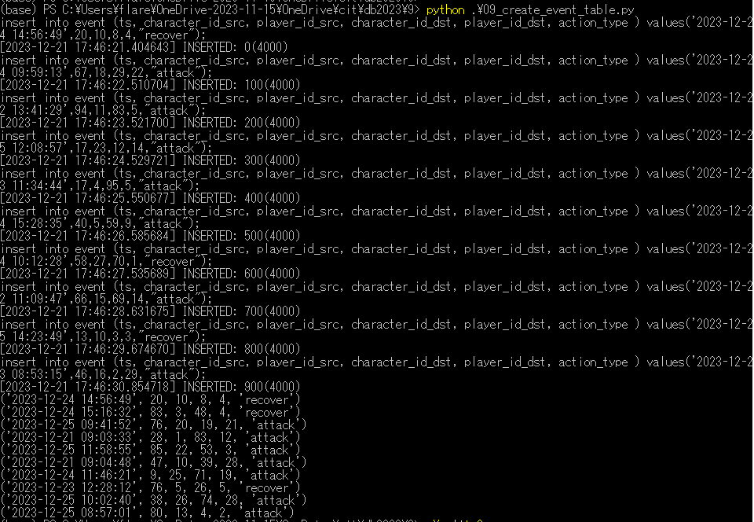
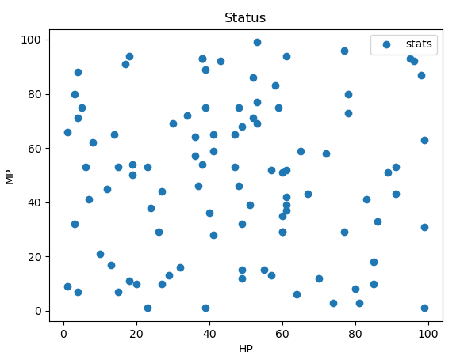

# 0. event テーブルの作成
<pre>
ts TIMESTAMP,  : タイムスタンプ
character_id_src INTEGER,  : アクション元のキャラクターID
player_id_src INTEGER, : アクション元のプレイヤーID
character_id_dst INTEGER, ： アクション先のキャラクターID
player_id_dst INTEGER, ：　アクション先のキャラクターID
action_type VARCHAR(20)　：　アクション種別「攻撃」「防御」
</pre>

<pre>
(base) PS C:\Users\flare\OneDrive-2023-11-15\OneDrive\cit\db2023\9> .\sqlite3.exe .\cit-db-2023-09.db
SQLite version 3.39.3 2022-09-05 11:02:23
Enter ".help" for usage hints.
sqlite> .tables
event
sqlite> .schema event
CREATE TABLE event (ts TIMESTAMP, character_id_src INTEGER, player_id_src INTEGER, character_id_dst INTEGER, player_id_dst INTEGER, action_type VARCHAR(20));
</pre>

一番攻撃を受けているCharacter_IDを検索
<pre>
sqlite> SELECT character_id_dst, count(*) FROM event GROUP BY character_id_dst ORDER BY COUNT(*) DESC LIMIT 5;
15|19
77|17
49|17
94|16
54|16
</pre>
# 1. HP, MPの分布を作成
<pre>
sqlite> .headers on
sqlite> .mode csv
sqlite> .once 9_1.csv
sqlite> SELECT HP, MP from character;
</pre>
<pre>
(base) PS C:\Users\flare\OneDrive-2023-11-15\OneDrive\cit\db2023\9> head -n 5 .\9_1.csv
HP,MP
6,53
43,92
60,51
34,72
</pre>
<pre>
(base) PS C:\Users\flare\OneDrive-2023-11-15\OneDrive\cit\db2023\9> python .\09_scatter_HP_MP_2.py
</pre>

