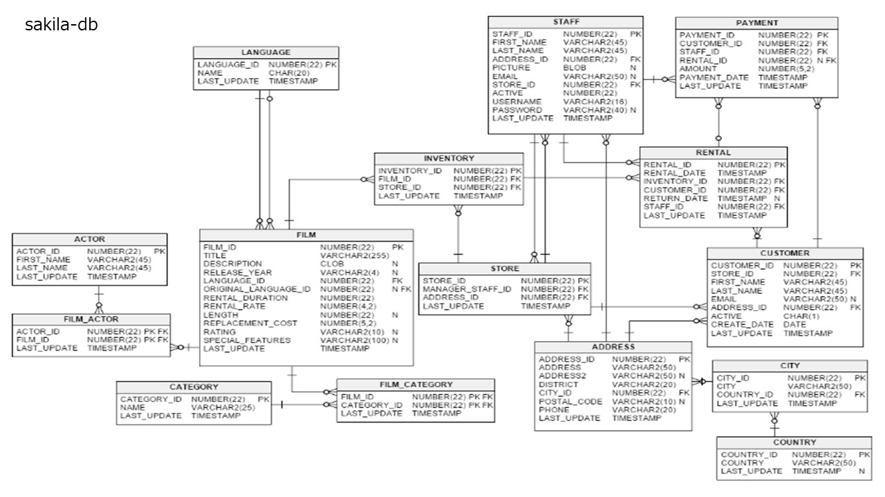

<pre>
PS D:\cit\db2024\3> .\sqlite3.exe .\sakila_master.db
SQLite version 3.39.3 2022-09-05 11:02:23
Enter ".help" for usage hints.

sqlite> .tables
actor                   film                    payment
address                 film_actor              rental
category                film_category           sales_by_film_category
city                    film_list               sales_by_store
country                 film_text               staff
customer                inventory               staff_list
customer_list           language                store
</pre>

<pre>
PS D:\cit\db2024\4> .\sqlite3.exe .\sakila_master.db

SQLite version 3.39.3 2022-09-05 11:02:23
Enter ".help" for usage hints.
sqlite>
sqlite> .tables
actor                   film                    payment
address                 film_actor              rental
category                film_category           sales_by_film_category
city                    film_list               sales_by_store
country                 film_text               staff
customer                inventory               staff_list
customer_list           language                store

# テーブルの情報を取得
  
sqlite> .schema customer
CREATE TABLE customer (
  customer_id INT NOT NULL,
  store_id INT NOT NULL,
  first_name VARCHAR(45) NOT NULL,
  last_name VARCHAR(45) NOT NULL,
  email VARCHAR(50) DEFAULT NULL,
  address_id INT NOT NULL,
  active CHAR(1) DEFAULT 'Y' NOT NULL,
  create_date TIMESTAMP NOT NULL,
  last_update TIMESTAMP NOT NULL,
  PRIMARY KEY  (customer_id),
  CONSTRAINT fk_customer_store FOREIGN KEY (store_id) REFERENCES store (store_id) ON DELETE NO ACTION ON UPDATE CASCADE,
  CONSTRAINT fk_customer_address FOREIGN KEY (address_id) REFERENCES address (address_id) ON DELETE NO ACTION ON UPDATE CASCADE
);
CREATE INDEX idx_customer_fk_store_id ON customer(store_id)
;
CREATE INDEX idx_customer_fk_address_id ON customer(address_id)
;
CREATE INDEX idx_customer_last_name ON customer(last_name)
;
CREATE TRIGGER customer_trigger_ai AFTER INSERT ON customer
 BEGIN
  UPDATE customer SET last_update = DATETIME('NOW')  WHERE rowid = new.rowid;
 END;
CREATE TRIGGER customer_trigger_au AFTER UPDATE ON customer
 BEGIN
  UPDATE customer SET last_update = DATETIME('NOW')  WHERE rowid = new.rowid;
 END;
 
sqlite> .schema address
CREATE TABLE address (
  address_id int NOT NULL,
  address VARCHAR(50) NOT NULL,
  address2 VARCHAR(50) DEFAULT NULL,
  district VARCHAR(20) NOT NULL,
  city_id INT  NOT NULL,
  postal_code VARCHAR(10) DEFAULT NULL,
  phone VARCHAR(20) NOT NULL,
  last_update TIMESTAMP NOT NULL,
  PRIMARY KEY  (address_id),
  CONSTRAINT fk_address_city FOREIGN KEY (city_id) REFERENCES city (city_id) ON DELETE NO ACTION ON UPDATE CASCADE
);
CREATE INDEX idx_fk_city_id ON address(city_id)
;
CREATE TRIGGER address_trigger_ai AFTER INSERT ON address
 BEGIN
  UPDATE address SET last_update = DATETIME('NOW')  WHERE rowid = new.rowid;
 END;
CREATE TRIGGER address_trigger_au AFTER UPDATE ON address
 BEGIN
  UPDATE address SET last_update = DATETIME('NOW')  WHERE rowid = new.rowid;
 END;
</pre>

# addressとcustomerのテーブルを結合
<pre>
sqlite> SELECT c.first_name, c.last_name, a.address FROM customer c JOIN address a ON c.address_id = a.address_id LIMIT 10;
MARY|SMITH|1913 Hanoi Way
PATRICIA|JOHNSON|1121 Loja Avenue
LINDA|WILLIAMS|692 Joliet Street
BARBARA|JONES|1566 Inegl Manor
ELIZABETH|BROWN|53 Idfu Parkway
JENNIFER|DAVIS|1795 Santiago de Compostela Way
MARIA|MILLER|900 Santiago de Compostela Parkway
SUSAN|WILSON|478 Joliet Way
MARGARET|MOORE|613 Korolev Drive
DOROTHY|TAYLOR|1531 Sal Drive
</pre>

# csvファイルの結合とインデックスの表示 - 4_6_csv_read.ipynb

<pre>
  state/region     ages  year  population
0           AL  under18  2012   1117489.0
1           AL    total  2012   4817528.0
2           AL  under18  2010   1130966.0
3           AL    total  2010   4785570.0
4           AL  under18  2011   1125763.0
        state  area (sq. mi)
0     Alabama          52423
1      Alaska         656425
2     Arizona         114006
3    Arkansas          53182
4  California         163707
        state abbreviation
0     Alabama           AL
1      Alaska           AK
</pre>
	
# 参考：外部結合

<pre>
	state/region	ages	year	population	state
0	AK	total	1990	553290.0	Alaska
1	AK	under18	1990	177502.0	Alaska
2	AK	total	1992	588736.0	Alaska
3	AK	under18	1991	182180.0	Alaska
4	AK	under18	1992	184878.0	Alaska
</pre>
<pre>
2     Arizona           AZ
3    Arkansas           AR
4  California           CA
</pre>

# 昨年度の内容 ############################################################

# 1. databaseを開く
<pre>
(base) PS C:\Users\flare\sqlite> .\sqlite3.exe .\sakila_master.db
SQLite version 3.39.3 2022-09-05 11:02:23
Enter ".help" for usage hints.
sqlite>
</pre>

# 2. tableの表示
<pre>
sqlite> .tables
actor                   film                    payment
address                 film_actor              rental
category                film_category           sales_by_film_category
city                    film_list               sales_by_store
country                 film_text               staff
customer                inventory               staff_list
customer_list           language                store
</pre>

# 3. actorのテーブルを見てみる
<pre>
sqlite> select * from actor limit 10;
1|PENELOPE|GUINESS|2020-12-23 07:12:29
2|NICK|WAHLBERG|2020-12-23 07:12:29
3|ED|CHASE|2020-12-23 07:12:29
4|JENNIFER|DAVIS|2020-12-23 07:12:29
5|JOHNNY|LOLLOBRIGIDA|2020-12-23 07:12:29
6|BETTE|NICHOLSON|2020-12-23 07:12:29
7|GRACE|MOSTEL|2020-12-23 07:12:29
8|MATTHEW|JOHANSSON|2020-12-23 07:12:29
9|JOE|SWANK|2020-12-23 07:12:29
10|CHRISTIAN|GABLE|2020-12-23 07:12:29
</pre>

# 課題. 在庫のテーブルから10件表示しなさい。
# 課題. actor_idが自分の出席番号が同じactorのfirst nameとlast nameを表示しなさい。

# 4. actorのschemaを調べる
<pre>
  sqlite> .schema actor
CREATE TABLE actor (
  actor_id numeric NOT NULL ,
  first_name VARCHAR(45) NOT NULL,
  last_name VARCHAR(45) NOT NULL,
  last_update TIMESTAMP NOT NULL,
  PRIMARY KEY  (actor_id)
  );
CREATE INDEX idx_actor_last_name ON actor(last_name)
;
CREATE TRIGGER actor_trigger_ai AFTER INSERT ON actor
 BEGIN
  UPDATE actor SET last_update = DATETIME('NOW')  WHERE rowid = new.rowid;
 END;
CREATE TRIGGER actor_trigger_au AFTER UPDATE ON actor
 BEGIN
  UPDATE actor SET last_update = DATETIME('NOW')  WHERE rowid = new.rowid;
 END;
</pre>

# 5. テーブルfilm_idとactorを結合する (内部結合）
<pre>
sqlite> SELECT actor.actor_id, first_name, last_name, film_id FROM actor INNER JOIN film_actor on actor.actor_id = film_actor.actor_id LIMIT 10;
1|PENELOPE|GUINESS|1
1|PENELOPE|GUINESS|23
1|PENELOPE|GUINESS|25
1|PENELOPE|GUINESS|106
1|PENELOPE|GUINESS|140
1|PENELOPE|GUINESS|166
1|PENELOPE|GUINESS|277
1|PENELOPE|GUINESS|361
1|PENELOPE|GUINESS|438
1|PENELOPE|GUINESS|499
</pre>

# 課題. filmとfilm_actorを内部結合し、下記のフィールドを表示しなさい。
<pre>
film.title
film.film_id
film_actor.actor_id
</pre>

# 課題. filmとfilm_actorを内部結合した課題1-3のテーブルから、actor_idが自分の出席番号の行を出力しなさい。

# 1. databaseを開く
<pre>
(base) PS C:\Users\flare\sqlite> .\sqlite3.exe .\sakila_master.db
SQLite version 3.39.3 2022-09-05 11:02:23
Enter ".help" for usage hints.
sqlite>
</pre>

# 2. tableの表示
<pre>
sqlite> .tables
actor                   film                    payment
address                 film_actor              rental
category                film_category           sales_by_film_category
city                    film_list               sales_by_store
country                 film_text               staff
customer                inventory               staff_list
customer_list           language                store
</pre>

# 3. actorのテーブルを見てみる
<pre>
sqlite> select * from actor limit 10;
1|PENELOPE|GUINESS|2020-12-23 07:12:29
2|NICK|WAHLBERG|2020-12-23 07:12:29
3|ED|CHASE|2020-12-23 07:12:29
4|JENNIFER|DAVIS|2020-12-23 07:12:29
5|JOHNNY|LOLLOBRIGIDA|2020-12-23 07:12:29
6|BETTE|NICHOLSON|2020-12-23 07:12:29
7|GRACE|MOSTEL|2020-12-23 07:12:29
8|MATTHEW|JOHANSSON|2020-12-23 07:12:29
9|JOE|SWANK|2020-12-23 07:12:29
10|CHRISTIAN|GABLE|2020-12-23 07:12:29
</pre>

# 課題. 在庫のテーブルから10件表示しなさい。
# 課題. actor_idが自分の出席番号が同じactorのfirst nameとlast nameを表示しなさい。

# 4. actorのschemaを調べる
<pre>
  sqlite> .schema actor
CREATE TABLE actor (
  actor_id numeric NOT NULL ,
  first_name VARCHAR(45) NOT NULL,
  last_name VARCHAR(45) NOT NULL,
  last_update TIMESTAMP NOT NULL,
  PRIMARY KEY  (actor_id)
  );
CREATE INDEX idx_actor_last_name ON actor(last_name)
;
CREATE TRIGGER actor_trigger_ai AFTER INSERT ON actor
 BEGIN
  UPDATE actor SET last_update = DATETIME('NOW')  WHERE rowid = new.rowid;
 END;
CREATE TRIGGER actor_trigger_au AFTER UPDATE ON actor
 BEGIN
  UPDATE actor SET last_update = DATETIME('NOW')  WHERE rowid = new.rowid;
 END;
</pre>

# 5. テーブルfilm_idとactorを結合する (内部結合）
<pre>
sqlite> SELECT actor.actor_id, first_name, last_name, film_id FROM actor INNER JOIN film_actor on actor.actor_id = film_actor.actor_id LIMIT 10;
1|PENELOPE|GUINESS|1
1|PENELOPE|GUINESS|23
1|PENELOPE|GUINESS|25
1|PENELOPE|GUINESS|106
1|PENELOPE|GUINESS|140
1|PENELOPE|GUINESS|166
1|PENELOPE|GUINESS|277
1|PENELOPE|GUINESS|361
1|PENELOPE|GUINESS|438
1|PENELOPE|GUINESS|499
</pre>

# 課題. filmとfilm_actorを内部結合し、下記のフィールドを表示しなさい。
<pre>
film.title
film.film_id
film_actor.actor_id
</pre>

# 課題. filmとfilm_actorを内部結合した課題1-3のテーブルから、actor_idが自分の出席番号の行を出力しなさい。

