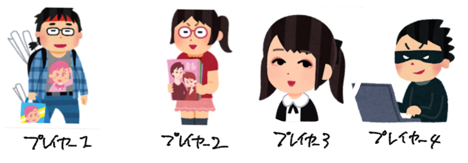
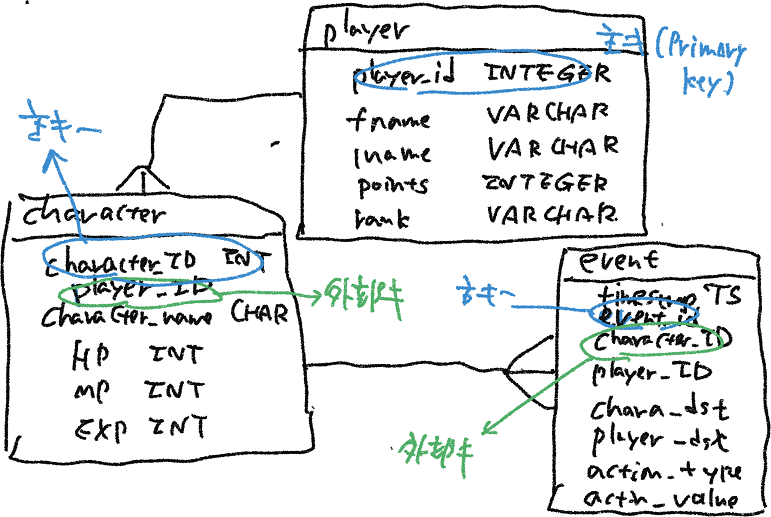
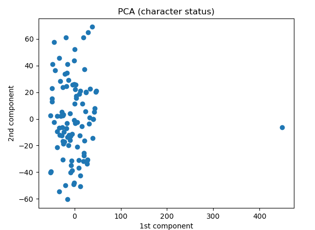
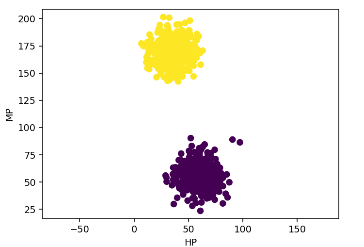

# playerテーブルとschemaテーブルを作成

<pre>
5_1_create_character_table.ipynb
5_2_create_player_table.ipynb
</pre>
  
<pre>
sqlite> .schema player
CREATE TABLE player (player_id INTEGER, fname VARCHAR(20), lname VARCHAR(20), points INTEGER, rank VARCHAR(20));
sqlite> .schema character
CREATE TABLE character (character_id INTEGER, player_id INTEGER, character_name VARCHAR(20), HP INTERGER, MP INTEGER, EXP INTEGER);
</pre>

# データ表示

<pre>
sqlite> select * from player limit 5;
0|Mjzxr|CZsIh|86|P
1|sMBWd|Dsvhv|53|B
2|IczjS|vmFSp|45|Y
3|sJFRD|CBCQf|35|P
4|ORsLl|NnvBJ|35|P
sqlite> select * from character limit 5;
0|15|doraemon|14|54|14
1|3|doraemon|21|47|42 
2|19|doraemon|38|16|20
3|5|golgo|60|69|65    
4|18|begita|26|56|23  
</pre>

# playerテーブルとcharacterテーブルをplayer_idで結合

<pre>
sqlite> SELECT player.player_id, player.fname, player.lname, player.points, player.rank, character.character_id, character.character_name,  character.HP, character.MP, character.EXP FROM player JOIN character ON player.player_id = character.player_id LIMIT 10;
1|sMBWd|Dsvhv|53|B|5|doraemon|16|54|83
1|sMBWd|Dsvhv|53|B|17|bikkuriko|20|13|47
1|sMBWd|Dsvhv|53|B|21|doraemon|31|60|63
1|sMBWd|Dsvhv|53|B|86|doraemon|13|90|32
2|IczjS|vmFSp|45|Y|44|akinator|39|23|56
2|IczjS|vmFSp|45|Y|65|doraemon|33|89|31
2|IczjS|vmFSp|45|Y|71|bikkuriko|75|88|36
2|IczjS|vmFSp|45|Y|84|akinator|46|86|2
2|IczjS|vmFSp|45|Y|88|begita|95|90|77
2|IczjS|vmFSp|45|Y|90|golgo|18|98|15
</pre>

# back-up: 2023-12回

Character * 100

# 1. バッチファイル実行
<pre>
(base) PS C:\Users\flare\cit\db2023\12> .\generate2.bat
</pre>

# 2.（初期状態の）characterのステータス表示
<pre>
(base) PS C:\Users\flare\cit\db2023\12> python .\12_show_character_status.py
</pre>

# 3. eventの生成　(1,000イベント）
<pre>
(base) PS C:\Users\flare\cit\db2023\12> git add .\12_create_event_table_2.py
</pre>

# 4. （イベント発生後の）characterのステータス表示
<pre>
(base) PS C:\Users\flare\cit\db2023\12> python .\12_show_character_status.py
</pre>

# 5. 主成分分析をする（次元削減）
<pre>
(base) PS C:\Users\flare\cit\db2023\12> python .\12_PCA.py
            1          2          3
0 -104.596930  19.291158   3.880632
1   11.651858   3.395903 -43.801231
2  108.681233 -15.832426 -54.598074
3  -41.445048 -63.821884  -4.667005
4  -55.848510  17.699070 -35.793752
</pre>

第１，第２主成分をプロット

# 6. 特殊なイベントを実装する1 (UPDATE利用)

「D」の修理

character_id = 9 のキャラクタのHPを500にする

stable diffusion: Above the big city, a good-looking Doraemon is frantically repairing a bad-looking Doraemon.

<pre>
(base) PS C:\Users\flare\cit\db2023\12> .\sqlite3.exe .\cit-db-2023-12.db
SQLite version 3.39.3 2022-09-05 11:02:23
Enter ".help" for usage hints.
sqlite> update character set HP = 500 where character_id = 9;
</pre>

<pre>
(base) PS C:\Users\flare\cit\db2023\12> python .\12_PCA.py
</pre>

One-class KVMで異常検知

<pre>
(base) PS C:\Users\flare\cit\db2023\12> python .\12_PCA_kmeans.py
           1          2          3
0 -31.201880  28.428707  -1.749345
1 -44.342107  -2.509248  61.773701
2  28.891464  64.919250  20.661151
3  44.339793   7.810922 -27.192668
4 -48.117434  15.261168  48.584341
[ 9 53  2 31 52]
anomaly 450.1047300909108
449.06757151470254
-6.246531054245064
</pre>

            
# 7. 特殊なイベントを実装する2 (UPDATE利用)

「Dの災厄」

Satble Diffusion: The evil-looking Doraemon is releasing a large number of fireballs from far up in the air.

全キャラクタのHPとMPの値を、強制的に次のような分布にする

<pre>
(base) PS C:\Users\flare\cit\db2023\12> python .\12_disaster_by_dora.py
(base) PS C:\Users\flare\cit\db2023\12> python .\12_PCA.py
</pre>

プログラム実行前

プログラム実行後

