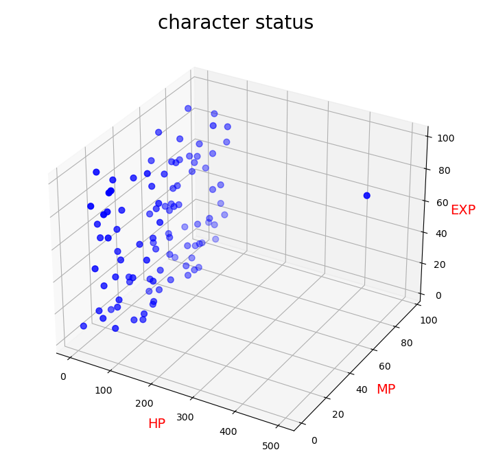
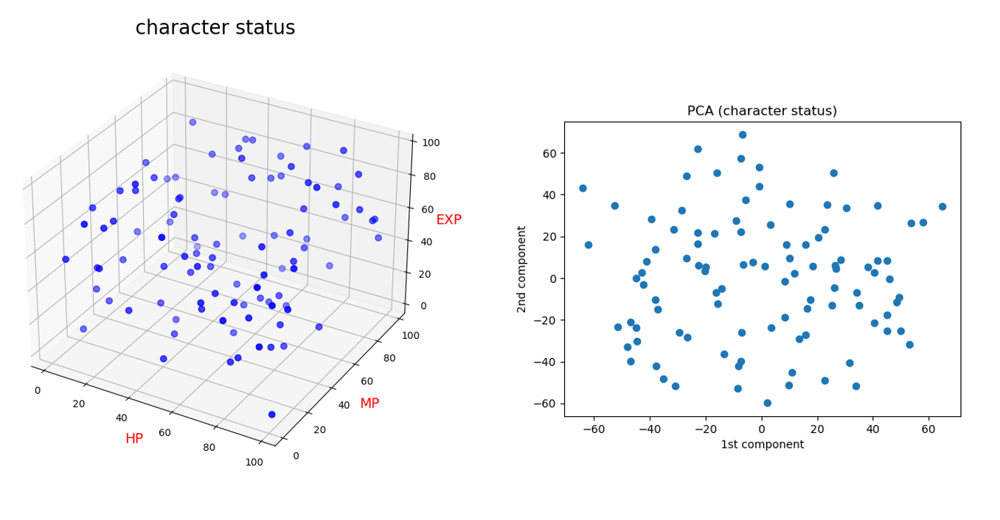

# 6.1 SQL tableの作成 (player, character, event)
<pre>
> python 6_1_create_character_table.py
> python 6_2_create_player_table.py
> python 6_3_create_event_table.py
</pre>
  
# 6.2 SQL スキーマの表示

<pre>
sqlite> .schema player
CREATE TABLE player (player_id INTEGER, fname VARCHAR(20), lname VARCHAR(20), points INTEGER, rank VARCHAR(20));
sqlite> .schema character
CREATE TABLE character (character_id INTEGER, player_id INTEGER, character_name VARCHAR(20), HP INTERGER, MP INTEGER, EXP INTEGER);
sqlite> .schema event
CREATE TABLE event (event_id INTEGER PRIMARY KEY, ts TIMESTAMP, character_id INTEGER, player_id INTEGER, character_id_dst INTEGER, player_id_dst INTEGER, action_type VARCHAR(20), action_value INTEGER);
</pre>

<pre>
イベントの生成
> python 6_3_create_event_table.py
</pre>

  
# 6.3 SQL playerテーブルとeventテーブルのJOIN

<pre>
sqlite> SELECT player.fname, player.lname, event.* FROM event JOIN player ON event.player_id = player.player_id WHERE event.player_id = 20 LIMIT 5;
xYvoT|gUPpW|12|2024-11-26 11:05:06|20|20|39|18|7|attack
xYvoT|gUPpW|22|2024-11-23 13:25:28|28|20|21|10|24|attack
xYvoT|gUPpW|41|2024-11-24 13:13:08|28|20|55|11|20|recover
xYvoT|gUPpW|60|2024-11-25 10:00:56|54|20|57|3|3|attack
xYvoT|gUPpW|101|2024-11-23 14:58:00|86|20|5|16|18|attack
</pre>

# 6.4 SQLの構文（テクニック）

<pre>
1. グループ化と集計
2. サブクエリ
3. 結合
4. 条件付きロジック
5. トランザクション
6. インデックスと制約
7. ビュー
8. メタデータ
9. 解析関数
</pre>

# 6.5 DataFrame 1対1結合

<pre>
1対1結合
import pandas as pd
import numpy as np

df1 = pd.DataFrame({'employee': ['Bob', 'Jake', 'Lisa', 'Sue'],
                    'group': ['Accounting', 'Engineering',
                              'Engineering', 'HR']})
df2 = pd.DataFrame({'employee': ['Lisa', 'Bob', 'Jake', 'Sue'],
                    'hire_date': [2004, 2008, 2012, 2014]})
</pre>

# 6.6 DataFrame 1対多結合

<pre>
1対多結合
import pandas as pd
df4 = pd.DataFrame({'group': ['Accounting', 'Engineering', 'HR'],
                    'supervisor': ['Carly', 'Guido', 'Steve']})
df5 = pd.merge(df3,df4)
</pre>

# 6.7 DataFrame 多対多結合

<pre>
import pandas as pd
df5 = pd.DataFrame({'group': ['Accounting', 'Accounting',
                              'Engineering', 'Engineering', 'HR', 'HR'],
                    'skills': ['math', 'spreadsheets', 'software', 'math',
                               'spreadsheets', 'organization']}
</pre>

# 6.8 SQL(1) サブクエリ
<pre>
クエリの結果をテーブルにして、再検索。
sqlite> SELECT cust.last_name, ",", cust.first_name FROM (select first_name, last_name, email FROM customer WHERE first_name = 'JESSIE') cust;
BANKS|,|JESSIE 
MILAM|,|JESSIE
</pre>

# 6.8 SQL(2) Group byとHaving
映画を40本以上レンタルしている顧客をすべてリストアップする。
<pre>
sqlite> SELECT c.first_name, c.last_name, count(*) FROM customer c INNER JOIN rental r ON c.customer_id = r.customer_id GROUP BY c.first_name, c.last_name HAVING count(*) >= 40;
CLARA|SHAW|42
ELEANOR|HUNT|46
KARL|SEAL|45
MARCIA|DEAN|42
SUE|PETERS|40
TAMMY|SANDERS|41
WESLEY|BULL|40
</pre>

# back-up: 2023-12回

Character * 100

# 1. バッチファイル実行
<pre>
(base) PS C:\Users\flare\cit\db2023\12> .\generate2.bat
</pre>

# 2.（初期状態の）characterのステータス表示
<pre>
(base) PS C:\Users\flare\cit\db2023\12> python .\12_show_character_status.py
</pre>

# 3. eventの生成　(1,000イベント）
<pre>
(base) PS C:\Users\flare\cit\db2023\12> git add .\12_create_event_table_2.py
</pre>

# 4. （イベント発生後の）characterのステータス表示
<pre>
(base) PS C:\Users\flare\cit\db2023\12> python .\12_show_character_status.py
</pre>

# 5. 主成分分析をする（次元削減）
<pre>
(base) PS C:\Users\flare\cit\db2023\12> python .\12_PCA.py
            1          2          3
0 -104.596930  19.291158   3.880632
1   11.651858   3.395903 -43.801231
2  108.681233 -15.832426 -54.598074
3  -41.445048 -63.821884  -4.667005
4  -55.848510  17.699070 -35.793752
</pre>

第１，第２主成分をプロット

# 6. 特殊なイベントを実装する1 (UPDATE利用)

「D」の修理

character_id = 9 のキャラクタのHPを500にする

stable diffusion: Above the big city, a good-looking Doraemon is frantically repairing a bad-looking Doraemon.

<pre>
(base) PS C:\Users\flare\cit\db2023\12> .\sqlite3.exe .\cit-db-2023-12.db
SQLite version 3.39.3 2022-09-05 11:02:23
Enter ".help" for usage hints.
sqlite> update character set HP = 500 where character_id = 9;
</pre>

<pre>
(base) PS C:\Users\flare\cit\db2023\12> python .\12_PCA.py
</pre>

One-class KVMで異常検知

<pre>
(base) PS C:\Users\flare\cit\db2023\12> python .\12_PCA_kmeans.py
           1          2          3
0 -31.201880  28.428707  -1.749345
1 -44.342107  -2.509248  61.773701
2  28.891464  64.919250  20.661151
3  44.339793   7.810922 -27.192668
4 -48.117434  15.261168  48.584341
[ 9 53  2 31 52]
anomaly 450.1047300909108
449.06757151470254
-6.246531054245064
</pre>

            
# 7. 特殊なイベントを実装する2 (UPDATE利用)

「Dの災厄」

Satble Diffusion: The evil-looking Doraemon is releasing a large number of fireballs from far up in the air.

全キャラクタのHPとMPの値を、強制的に次のような分布にする

<pre>
(base) PS C:\Users\flare\cit\db2023\12> python .\12_disaster_by_dora.py
(base) PS C:\Users\flare\cit\db2023\12> python .\12_PCA.py
</pre>

プログラム実行前

プログラム実行後

