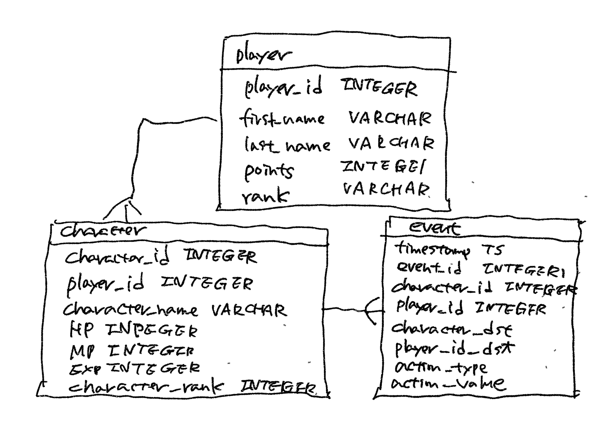

# テーブル項目修正 (2024-12-01)

# playerテーブルとeventテーブルの結合
<pre>
sqlite> SELECT player.first_name, player.last_name, player.player_rank, event.* FROM event JOIN player ON event.player_id = player.player_id WHERE event.player_id = 20 LIMIT 5;
VLNJX|ckhKB|3|6|2024-12-04 12:09:59|7|20|20|8|28|recover
VLNJX|ckhKB|3|21|2024-12-04 10:47:04|1|20|53|1|19|recover
VLNJX|ckhKB|3|25|2024-12-05 10:33:37|87|20|33|19|3|attack
VLNJX|ckhKB|3|36|2024-12-04 11:49:38|76|20|5|19|19|attack
VLNJX|ckhKB|3|39|2024-12-02 10:08:17|97|20|44|2|21|attack
</pre>

# テーブルの結合: 郵便番号で検索 (addressとcustomer)
<pre>
sqlite> SELECT c.first_name, c.last_name, a.address FROM customer c INNER JOIN address a ON c.address_id = a.address_id WHERE a.postal_code = 52137;
JAMES|GANNON|1635 Kuwana Boulevard
FREDDIE|DUGGAN|1103 Quilmes Boulevard
</pre>
<pre>
sqlite> .schema address
CREATE TABLE address (
  address_id int NOT NULL,
  address VARCHAR(50) NOT NULL,
  address2 VARCHAR(50) DEFAULT NULL,
  district VARCHAR(20) NOT NULL,
  city_id INT  NOT NULL,
  postal_code VARCHAR(10) DEFAULT NULL,
  phone VARCHAR(20) NOT NULL,
  last_update TIMESTAMP NOT NULL,
  PRIMARY KEY  (address_id),
  CONSTRAINT fk_address_city FOREIGN KEY (city_id) REFERENCES city (city_id) ON DELETE NO ACTION ON UPDATE CASCADE
);

sqlite> .schema customer
CREATE TABLE customer (
  customer_id INT NOT NULL,
  store_id INT NOT NULL,
  first_name VARCHAR(45) NOT NULL,
  last_name VARCHAR(45) NOT NULL,
  email VARCHAR(50) DEFAULT NULL,
  address_id INT NOT NULL,
  active CHAR(1) DEFAULT 'Y' NOT NULL,
  create_date TIMESTAMP NOT NULL,
  last_update TIMESTAMP NOT NULL,
  PRIMARY KEY  (customer_id),
  CONSTRAINT fk_customer_store FOREIGN KEY (store_id) REFERENCES store (store_id) ON DELETE NO ACTION ON UPDATE CASCADE,
  CONSTRAINT fk_customer_address FOREIGN KEY (address_id) REFERENCES address (address_id) ON DELETE NO ACTION ON UPDATE CASCADE
);
</pre>

# 3つ以上のテーブルを結合 (addressとcustomerとcity)
<pre>
sqlite> select c.first_name, c.last_name, ct.city FROM customer c INNER JOIN address a ON c.address_id = a.address_id INNER JOIN city ct ON a.city_id = ct.city_id LIMIT 5;
MARY|SMITH|Sasebo
PATRICIA|JOHNSON|San Bernardino
LINDA|WILLIAMS|Athenai
BARBARA|JONES|Myingyan
ELIZABETH|BROWN|Nantou
</pre>
<pre>
sqlite> .schema city
CREATE TABLE city (
  city_id int NOT NULL,
  city VARCHAR(50) NOT NULL,
  country_id SMALLINT NOT NULL,
  last_update TIMESTAMP NOT NULL,
  PRIMARY KEY  (city_id),
  CONSTRAINT fk_city_country FOREIGN KEY (country_id) REFERENCES country (country_id) ON DELETE NO ACTION ON UPDATE CASCADE
);
</pre>

