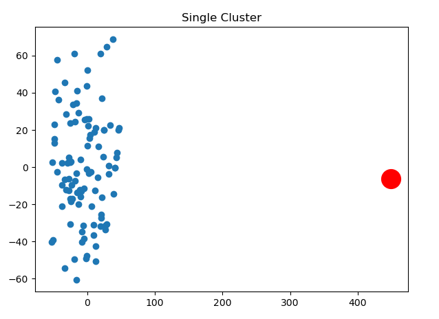

# 8.1 SQLクエリのリストアップ
<pre>
1. addressとcustomerのテーブルを結合
sqlite> SELECT c.first_name, c.last_name, a.address FROM customer c JOIN address a ON c.address_id = a.address_id LIMIT 10;
MARY|SMITH|1913 Hanoi Way
PATRICIA|JOHNSON|1121 Loja Avenue
LINDA|WILLIAMS|692 Joliet Street
BARBARA|JONES|1566 Inegl Manor

2. テーブルfilm_idとactorを結合する (内部結合）
sqlite> SELECT actor.actor_id, first_name, last_name, film_id FROM actor INNER JOIN film_actor on actor.actor_id = film_actor.actor_id LIMIT 10;
1|PENELOPE|GUINESS|1
1|PENELOPE|GUINESS|23

3. 内部結合
sqlite> SELECT c.first_name, c.last_name, a.address FROM customer c JOIN address a ON c.address_id = a.address_id LIMIT 5;
MARY|SMITH|1913 Hanoi Way
PATRICIA|JOHNSON|1121 Loja Avenue
LINDA|WILLIAMS|692 Joliet Street
BARBARA|JONES|1566 Inegl Manor
ELIZABETH|BROWN|53 Idfu Parkway

4. 複数のテーブルを結合
sqlite> SELECT c.first_name, c.last_name, ct.city FROM customer c INNER JOIN address a ON c.address_id = a.address_id INNER JOIN city ct ON a.city_id = ct.city_id LIMIT 5;
MARY|SMITH|Sasebo
PATRICIA|JOHNSON|San Bernardino
LINDA|WILLIAMS|Athenai
BARBARA|JONES|Myingyan
ELIZABETH|BROWN|Nantou

5. クエリの結果をテーブルにして、再検索。
sqlite> SELECT cust.last_name, ",", cust.first_name FROM (select first_name, last_name, email FROM customer WHERE first_name = 'JESSIE') cust;
BANKS|,|JESSIE 
MILAM|,|JESSIE

6. グループかと集計：映画を40本以上レンタルしている顧客をすべてリストアップする。
sqlite> SELECT c.first_name, c.last_name, count(*) FROM customer c INNER JOIN rental r ON c.customer_id = r.customer_id GROUP BY c.first_name, c.last_name HAVING count(*) >= 40;
CLARA|SHAW|42
ELEANOR|HUNT|46
KARL|SEAL|45
MARCIA|DEAN|42
SUE|PETERS|40
TAMMY|SANDERS|41
WESLEY|BULL|40

7. テーブルの結合: 郵便番号で検索 (addressとcustomer)
sqlite> SELECT c.first_name, c.last_name, a.address FROM customer c INNER JOIN address a ON c.address_id = a.address_id WHERE a.postal_code = 52137;
JAMES|GANNON|1635 Kuwana Boulevard
FREDDIE|DUGGAN|1103 Quilmes Boulevard

8. sakila - 3つ以上のテーブルを結合 (addressとcustomerとcity)
sqlite> select c.first_name, c.last_name, ct.city FROM customer c INNER JOIN address a ON c.address_id = a.address_id INNER JOIN city ct ON a.city_id = ct.city_id LIMIT 5;
MARY|SMITH|Sasebo
PATRICIA|JOHNSON|San Bernardino
LINDA|WILLIAMS|Athenai
BARBARA|JONES|Myingyan
ELIZABETH|BROWN|Nantou

9. ビュー（仮想テーブル）を作成
sqlite> CREATE VIEW cust_vw AS SELECT customer_id, first_name, last_name, active FROM customer;
sqlite> SELECT first_name, last_name FROM cust_vw WHERE active = 0 LIMIT 5;
SANDRA|MARTIN
JUDITH|COX
SHEILA|WELLS
ERICA|MATTHEWS
HEIDI|LARSON

10. レーティングがGで、一週間以上レンタルできる映画
sqlite> SELECT title FROM film WHERE rating = 'G' AND rental_duration >= 7 LIMIT 5;
BLANKET BEVERLY
BORROWERS BEDAZZLED
BRIDE INTRIGUE
CATCH AMISTAD
CITIZEN SHREK

11. 2005年6月14分に映画をレンタルした顧客全員を取得する
sqlite> SELECT c.first_name, c.last_name, time (r.rental_date) rental_time FROM customer c INNER JOIN rental r ON c.customer_id = r.customer_id WHERE date(r.rental_date) = '2005-06-14' LIMIT 5;
JEFFERY|PINSON|22:53:33
ELMER|NOE|22:55:1300
MINNIE|ROMERO|23:00:34
MIRIAM|MCKINNEY|23:07:08
DANIEL|CABRAL|23:09:38

12. 11を名前順にソート
sqlite> SELECT c.first_name, c.last_name, time (r.rental_date) rental_time FROM customer c INNER JOIN rental r ON c.customer_id = r.customer_id WHERE date(r.rental_date) = '2005-06-14' ORDER BY c.last_name, c.first_name LIMIT 5;
DANIEL|CABRAL|23:09:38
CATHERINE|CAMPBELL|23:17:03
HERMAN|DEVORE|23:35:09
AMBER|DIXON|23:42:56
JOYCE|EDWARDS|23:16:26

13. メンバーシップ条件 ratingがGかPGの映画をリストアップ
sqlite> SELECT title, rating FROM film WHERE rating = 'G' OR rating = 'PG' LIMIT 5;
ACADEMY DINOSAUR|PG
ACE GOLDFINGER|G
AFFAIR PREJUDICE|GQ
AFRICAN EGG|G
AGENT TRUMAN|PG

14. マッチング条件 ワイルドカードの利用
sqlite> select last_name, first_name FROM customer WHERE last_name LIKE '_A_T%S';
MATTHEWS|ERICA
WALTERS|CASSANDRA
WATTS|SHELLY

15. サブクエリをテーブルとして使う
SELECT c.first_name, c.last_name, addr.address, addr.city FROM customer c INNER JOIN (SELECT a.address_id, a.address, ct.city FROM address a INNER JOIN city ct ON a.city_id = ct.city_id WHERE a.district = 'California') addr ON c.address_id = addr.address_id;
  
16. グループ化と集計　レンタル回数が最も多い顧客を突き止める
sqlite> SELECT customer_id, count(*) FROM rental GROUP BY customer_id ORDER BY 2 DESC LIMIT 5;
148|46
526|45
144|42
236|42
75|41

17. 集計関数　レンタル料金
sqlite> SELECT MAX(amount) max_amt, MIN(amount) min_amnt, AVG(amount) avg_amt, SUM(amount) sum_amt, COUNT(*) num_payments FROM payment;
11.99|0|4.20066733129741|67416.5099999921|16049

18. 非相関サブクエリ
sqlite> SELECT city_id, city FROM city WHERE country_id <> (SELECT country_id FROM country WHERE country = 'India') LIMIT 5;
1|A Corua (La Corua)
2|Abha
3|Abu Dhabi
4|Acua
5|Adana
</pre>

# 8.2 playerテーブルとchacterテーブルの結合(1)
<pre>
character_rankで順序付ける
sqlite> SELECT p.first_name, p.last_name, p.player_rank, c.* FROM character c JOIN player p ON c.player_id = p.player_id WHERE p.player_id = 20 order by c.character_rank;
glsYS|xQIfC|7|0|20|doraemon|24|28|21|1
glsYS|xQIfC|7|127|20|doraemon|68|2|39|1
glsYS|xQIfC|7|134|20|doraemon|82|91|54|3
glsYS|xQIfC|7|159|20|doraemon|29|30|12|3
glsYS|xQIfC|7|56|20|doraemon|3|33|70|4
glsYS|xQIfC|7|91|20|bikkuriko|-71|59|42|6
glsYS|xQIfC|7|28|20|akinator|50|3|87|8
</pre>

# 8.3 playerテーブルとchacterテーブルの結合(2)
<pre>
id=20と24のプレイヤーの持ちキャラのランクの平均を計算(サブクエリをテーブルとして使う)
sqlite> SELECT AVG(character_rank) FROM (SELECT p.first_name, p.last_name, p.player_rank, c.* FROM character c JOIN player p ON c.player_id = p.player_id WHERE p.player_id = 20 order by c.character_rank);
3.71428571428571
sqlite> SELECT AVG(character_rank) FROM (SELECT p.first_name, p.last_name, p.player_rank, c.* FROM character c JOIN player p ON c.player_id = p.player_id WHERE p.player_id = 24 order by c.character_rank);
7.22222222222222
</pre>

# 8.4 特殊なイベントを実装する1 (UPDATE利用)

「D」の修理

character_id = 9 のキャラクタのHPを500にする

stable diffusion: Above the big city, a good-looking Doraemon is frantically repairing a bad-looking Doraemon.

<pre>
(base) PS C:\Users\flare\cit\db2023\12> .\sqlite3.exe .\cit-db-2023-12.db
SQLite version 3.39.3 2022-09-05 11:02:23
Enter ".help" for usage hints.
sqlite> update character set HP = 500 where character_id = 9;
</pre>

<pre>
(base) PS C:\Users\flare\cit\db2023\12> python .\12_PCA.py
</pre>

One-class KVMで異常検知

<pre>
(base) PS C:\Users\flare\cit\db2023\12> python .\12_PCA_kmeans.py
           1          2          3
0 -31.201880  28.428707  -1.749345
1 -44.342107  -2.509248  61.773701
2  28.891464  64.919250  20.661151
3  44.339793   7.810922 -27.192668
4 -48.117434  15.261168  48.584341
[ 9 53  2 31 52]
anomaly 450.1047300909108
449.06757151470254
-6.246531054245064
</pre>

            
# 8.5 特殊なイベントを実装する2 (UPDATE利用)

「Dの災厄」

Satble Diffusion: The evil-looking Doraemon is releasing a large number of fireballs from far up in the air.

全キャラクタのHPとMPの値を、強制的に次のような分布にする

<pre>
(base) PS C:\Users\flare\cit\db2024\8> python  8_4_disaster_dora.py
(base) PS C:\Users\flare\cit\db2024\8> python  8_5_PCA.py
</pre>

プログラム実行前

プログラム実行後

