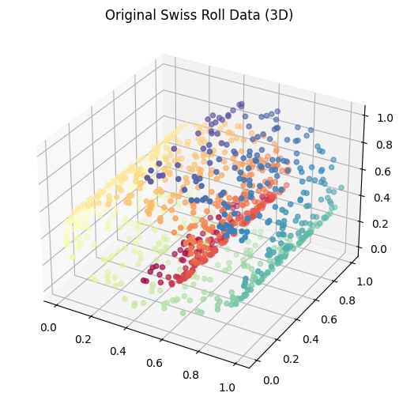
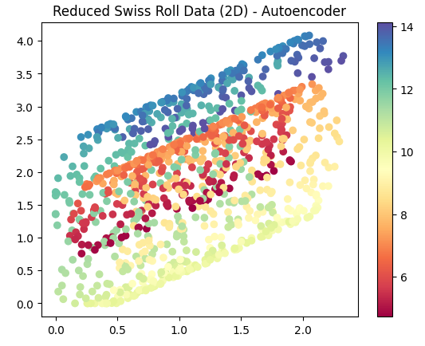

# データセット (12/16)
<pre>
1 employee：従業員
2 state_abberevs：アメリカ人口
3 state_areas：アメリカ人口
4 state_population：アメリカ人口
5 movie：映画
6 slb_stock：株価
7 Iris：アヤメの花
8 California housing dataset: カリフォルニア住宅価格
9 Pima Indians dataset: Pimaインド糖尿病データセット
10 Seattle Bycicle：シアトル自転車
11 planets: 惑星
12 Breast canser: ガン（病気）
13 credit card fraud detection：クレジットカード不正利用
</pre>

# 第１０回以降の予定
<pre>
1.３種類の結合（１対１、１対多、多対多）
2. 集約 Groupby メソッド
3. 時系列 頻度とオフセット
4. 時系列 再サンプリング
5. 階層型インデックス
6. 結合 applyメソッド
7. 移動窓関数
</pre>
  
# SQL*5

1. 相関サブクエリ レンタル回数がちょうど20回の顧客
<pre>
sqlite> SELECT c.first_name, c.last_name FROM customer c WHERE 20 = (SELECT count(*) FROM rental r WHERE r.customer_id = c.customer_id) LIMIT 10;
LAUREN|HUDSON
JEANETTE|GREENE
TARA|RYAN
WILMA|RICHARDS
JO|FOWLER
KAY|CALDWELL
DANIEL|CABRAL
ANTHONY|SCHWAB
TERRY|GRISSOM
LUIS|YANEZ
</pre>

2. EXITSTS演算子 2005年5月25日よりも前に少なくも1本レンタルした顧客を列挙
<pre>
sqlite> SELECT c.first_name, c.last_name FROM customer c WHERE EXISTS (SELECT 1 FROM rental r WHERE r.customer_id = c.customer_id AND date(r.rental_date) < '2005-05-25');
CHARLOTTE|HUNTER
DELORES|HANSEN
MINNIE|ROMERO
CASSANDRA|WALTERS
ANDREW|PURDY
MANUEL|MURRELL
TOMMY|COLLAZO
NELSON|CHRISTENSON
</pre>

3. 解析関数 タスク指向のサブクエリ - 各顧客の名前、住所、支払総額、レンタル回数のレポートを作成
<pre>
payment, customer, address, cityの4つのテーブルを結合し、氏名に基づいてグループ化

sqlite> SELECT c.first_name, c.last_name, ct.city, sum(p.amount) tot_payments, count(*) tot_rentals FROM payment p INNER JOIN customer c ON p.customer_id = c.customer_id INNER JOIN address a ON c.address_id = a.address_id INNER JOIN city ct ON a.city_id = ct.city_id GROUP BY c.first_name, c.last_name, ct.city LIMIT 10;
AARON|SELBY|Mwene-Ditu|110.76|24
ADAM|GOOCH|Adoni|101.78|22
ADRIAN|CLARY|Udine|74.81|19
AGNES|BISHOP|Sambhal|98.77|23
ALAN|KAHN|Emeishan|124.74|26
ALBERT|CROUSE|Bamenda|99.77|23
ALBERTO|HENNING|Barcelona|66.79|21
ALEX|GRESHAM|Uruapan|151.67|33
ALEXANDER|FENNELL|Bergamo|151.64|36
ALFRED|CASILLAS|Sawhaj|120.74|26
</pre>

4. 条件付きロジック customer.active列を追加する
<pre>
sqlite> SELECT first_name, last_name, CASE WHEN active = 1 THEN 'ACTIVE' ELSE 'INACTIVE' END active_type FROM customer LIMIT 10;
MARY|SMITH|ACTIVE
PATRICIA|JOHNSON|ACTIVE
LINDA|WILLIAMS|ACTIVE
BARBARA|JONES|ACTIVE
ELIZABETH|BROWN|ACTIVE
JENNIFER|DAVIS|ACTIVE
MARIA|MILLER|ACTIVE
SUSAN|WILSON|ACTIVE
MARGARET|MOORE|ACTIVE
DOROTHY|TAYLOR|ACTIVE
</pre>

5. 条件付きロジック - サブクエリを使ってレンタル回数を返す
<pre>
SELECT c.first_name, c.last_name CASE WHEN active = 0 THEN 0 ELSE (SELECT count(*) FROM rental r WHERE r.customer_id = c.customer_id) END NUM_rentals FROM customer c;
MARY|SMITH|ACTIVE
PATRICIA|JOHNSON|ACTIVE
LINDA|WILLIAMS|ACTIVE
BARBARA|JONES|ACTIVE
ELIZABETH|BROWN|ACTIVE
JENNIFER|DAVIS|ACTIVE
MARIA|MILLER|ACTIVE
SUSAN|WILSON|ACTIVE
MARGARET|MOORE|ACTIVE
DOROTHY|TAYLOR|ACTIVE
</pre>

