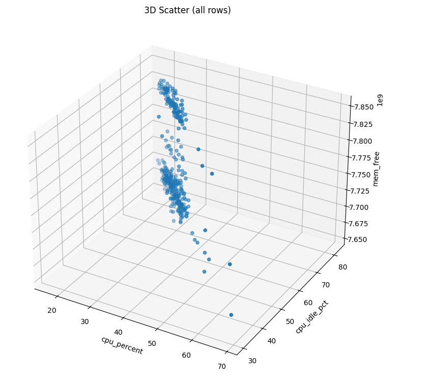
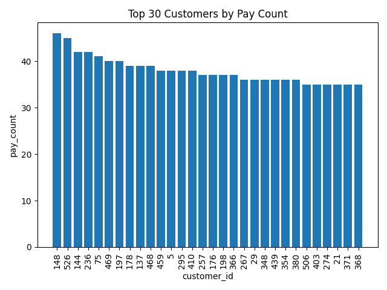
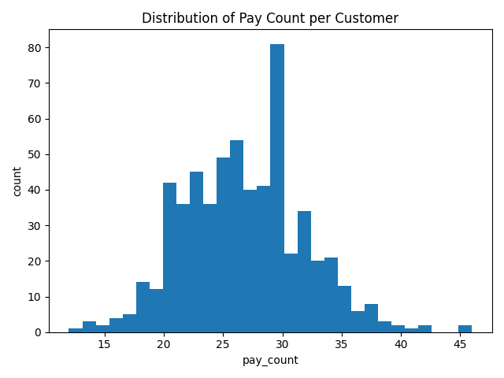

# System utilization

<pre>
1. 基本
ts：サンプル取得時刻（UTC, ISO8601 例: 2025-10-12T13:45:05.489170Z）
hostname / username：記録したマシン名／ユーザー名（識別用）

2. CPU（全体）
cpu_percent：全コア合成のCPU使用率 [%]。psutil.cpu_percent(interval=…) の結果。
temp_c：CPU温度 [℃]。LHM/OpenHardwareMonitor/ACPIの順で取得。権限や機種により NULL になることあり。

3. CPU（内訳・統計）
cpu_user_pct：ユーザ空間のCPU使用率 [%]
cpu_system_pct：カーネル（システム）時間のCPU使用率 [%]
cpu_idle_pct：アイドル時間の割合 [%]
cpu_iowait_pct：I/O待ちの割合 [%]（Windowsでは常にNULLのことあり）
cpu_ctx_switches：コンテキストスイッチ回数（累積→瞬時取得時点のカウンタ）
cpu_interrupts：ハードウェア割り込み回数（累積）
cpu_soft_intr：ソフトウェア割り込み回数（累積；OSによりNULL）
cpu_syscalls：システムコール回数（累積；プラットフォーム依存でNULL）
cpu_logical：論理CPU数（ハイパースレッディング含む）
cpu_physical：物理コア数（取得不可な環境ではNULL）
CPU（周波数）
cpu_freq_mhz：現在の平均CPU周波数 [MHz]
cpu_freq_min_mhz / cpu_freq_max_mhz：CPU周波数の想定最小/最大 [MHz]（環境でNULLあり）
per_core_cpu：各コアのCPU使用率 [%] の配列を JSON文字列で保存（例：[3.1, 7.4, …]）
per_core_freq：各コアの現在周波数 [MHz] の配列を JSON文字列で保存（取得不可ならNULL）

4. メモリ（RAM）
mem_percent：メモリ使用率 [%]
mem_total：総メモリ容量 [バイト]
mem_available：新規割当てに利用可能なメモリ推定値 [バイト]

mem_used：使用中メモリ [バイト]（OSの定義に依存）
mem_free：完全な未使用メモリ [バイト]
mem_cached：ページキャッシュ量 [バイト]（WindowsではNULLのことあり）
mem_buffers：バッファ量 [バイト]（Linux中心・WindowsではNULL）
mem_shared：共有メモリ量 [バイト]（OS依存・多くはNULL）

5. スワップ
swap_percent：スワップ使用率 [%]
swap_total / swap_used / swap_free：スワップ総量／使用量／空き [バイト]
swap_sin / swap_sout：スワップイン／アウトの累積バイト数（OSによりNULL）

6. 負荷平均（UNIX系）
load1 / load5 / load15：1/5/15分のロードアベレージ（Windowsは通常 NULL)

</pre>

<pre>
customer_id：顧客の主キー。JOINの基準。
first_name / last_name：顧客名。表記ゆれ・重複名あり得るため識別はIDで。
active：現在の顧客状態（1/0）。「休眠」とは別概念（下記 days_since_* 参照）。
store_id：所属店舗ID。店舗別集計・比較のキー。

total_payment：支払総額（SUM(payment.amount)）。通貨単位は元データに依存。返金や負値があれば要注意。
pay_count：支払回数（COUNT(*)）。小口多回か、大口少回かの把握に有用。
avg_payment：平均支払額（AVG(amount)）。高単価顧客の特定に。外れ値の影響を受ける点に留意。
max_payment：最大支払額（MAX(amount)）。高額取引の有無指標。不正/例外の早期検知にも使える。
pay_span：初回支払〜最終支払の期間（日）（julianday(max)-julianday(min)）。0 は同日内のみの取引。NULL は支払記録なし。
days_since_pay：最終支払から今日までの日数（julianday('now')-julianday(max)）。小さいほど最近アクティブ。NULL は支払記録なし。

rent_count：レンタル件数（COUNT(*)）。利用頻度の基本指標。
rent_span：初回レンタル〜最終レンタルの期間（日）。0 は同日内のみの利用。NULL はレンタル記録なし。
avg_rent_interval：平均レンタル間隔（日）（rent_count>1 のとき rent_span/(rent_count-1)）。連続利用のテンポ感。1件のみは算出不可のため NULL。
days_since_rent：最終レンタルから今日までの日数。小さいほど直近に利用。NULL はレンタル記録なし。
</pre>

# sakila-DB

<pre>
1.
customer_id
SELECT c.customer_id

2.
first_name
SELECT c.first_name

3.
last_name
SELECT c.last_name

4.
active
SELECT c.active

5.
store_id
SELECT c.store_id

6.
total_payment（顧客別の支払総額）
SELECT customer_id, SUM(amount) AS total_payment FROM payment GROUP BY customer_id

7.
pay_count（顧客別の支払回数）
SELECT customer_id, COUNT(*) AS pay_count FROM payment GROUP BY customer_id

8.
avg_payment（顧客別の平均支払額）
SELECT customer_id, AVG(amount) AS avg_payment FROM payment GROUP BY customer_id

9.
max_payment（顧客別の最大支払額）
SELECT customer_id, MAX(amount) AS max_payment FROM payment GROUP BY customer_id

10.
pay_span（日）（初回支払～最終支払の期間：SQLite想定）
SELECT customer_id, (julianday(MAX(payment_date)) - julianday(MIN(payment_date))) AS pay_span FROM payment GROUP BY customer_id

11.
days_since_pay（日）（最終支払から今日まで：SQLite想定）
SELECT customer_id, (julianday('now') - julianday(MAX(payment_date))) AS days_since_pay FROM payment GROUP BY customer_id

12.
rent_count（顧客別のレンタル件数）
SELECT customer_id, COUNT(*) AS rent_count FROM rental GROUP BY customer_id

13.
rent_span（日）（初回レンタル～最終レンタルの期間：SQLite想定）
SELECT customer_id, (julianday(MAX(rental_date)) - julianday(MIN(rental_date))) AS rent_span FROM rental GROUP BY customer_id

14.
days_since_rent（日）（最終レンタルから今日まで：SQLite想定）
SELECT customer_id, (julianday('now') - julianday(MAX(rental_date))) AS days_since_rent FROM rental GROUP BY customer_id

15.
avg_rent_interval（日）（平均レンタル間隔：件数>1のみ有効、SQLite想定）
WITH r AS (SELECT customer_id, (julianday(MAX(rental_date)) - julianday(MIN(rental_date))) AS span, COUNT() AS n FROM rental GROUP BY customer_id) SELECT customer_id, CASE WHEN n>1 THEN span1.0/(n-1) END AS avg_rent_interval FROM r
</pre>

